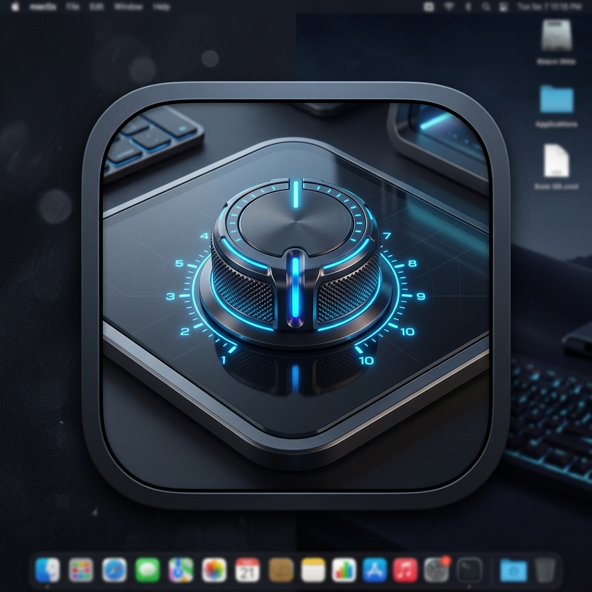
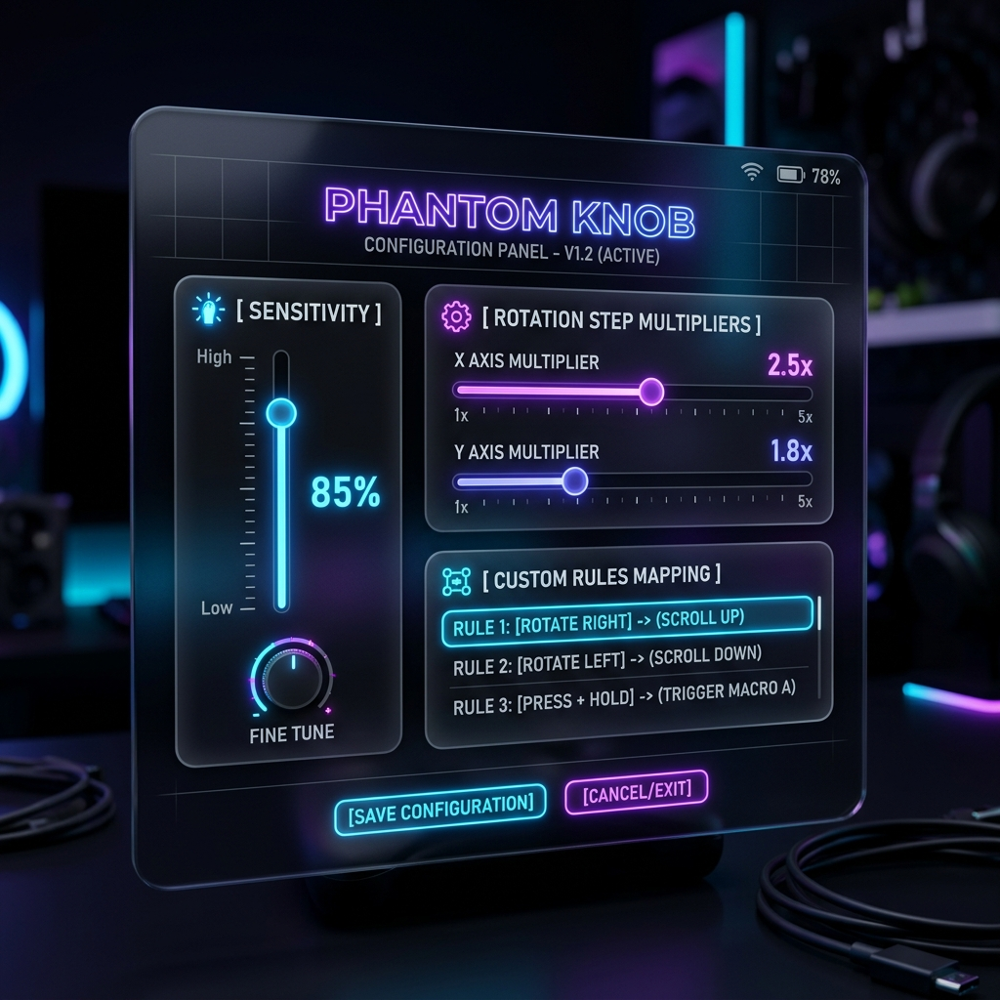
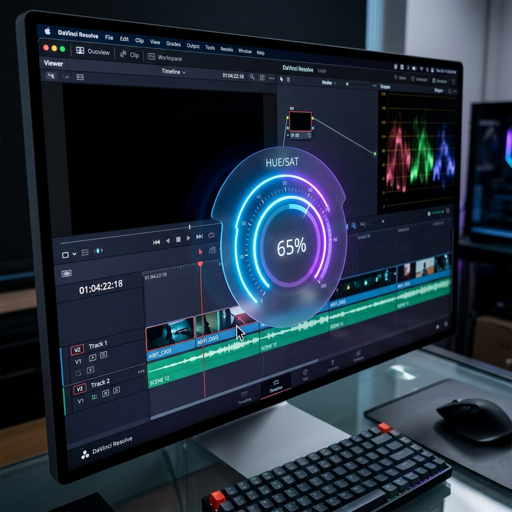
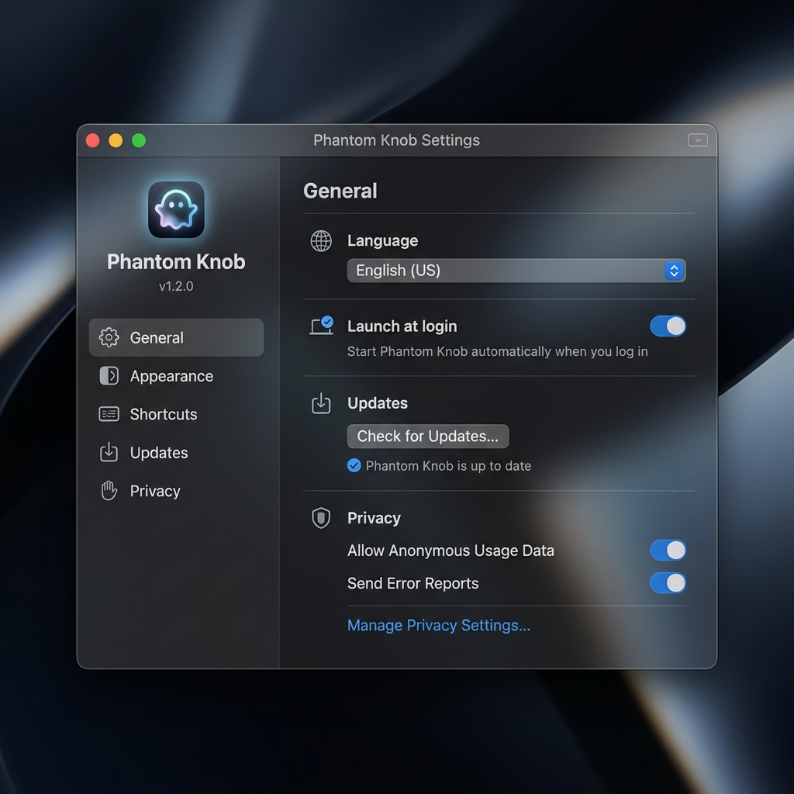
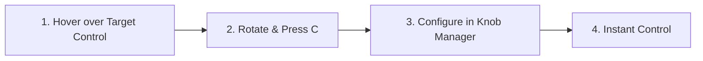

<p align="center">
  <a href="https://benwu232.github.io/PhantomKnob/">
    
  </a>
</p>

<h1 align="center">PhantomKnob</h1>

<p align="center">
  <b>Unlock the Magical Rotary Dial and Portable Creative Console Hidden Inside Your Mac Trackpad.</b><br>
  No extra hardware required. Rotate two fingers to hover-adjust any app slider, video timeline playhead, and color wheel. Three fingers for system volume and hardware external monitor brightness.
</p>

<p align="center">
  <a href="README.md"><b>English</b></a> |
  <a href="README_zh.md">简体中文</a> |
  <a href="https://benwu232.github.io/PhantomKnob/">Official Website</a>
</p>

<p align="center">
  <a href="https://github.com/benwu232/PhantomKnob/releases/"></a>
</p>

<p align="center">
  <a href="https://github.com/benwu232/PhantomKnob/releases/latest"></a>
  
  
  
  <a href="#license"></a>
</p>

<p align="center">
  
</p>

---

## Table of Contents

- [✨ 36-Second Video Demonstrations](#video-demos)
- [🚀 Quick Start & Installation](#quick-start)
- [🎯 Three Core Scenarios](#scenes)
  - [1. System Quick Knob (3-Finger Blind Control)](#scene-quick-knob)
  - [2. Daily Applications (2-Finger Dial & Flywheel)](#scene-daily-apps)
  - [3. Mobile Creative Console (Video & Photo Grading)](#scene-pro-console)
- [🛠️ How to Customize Knobs for Any App](#customize)
- [🔬 Technical Principles & Architecture (For Geeks)](#principles)
- [⚖️ Why Trackpad Over Physical Hardware?](#vs-hardware)
- [💎 Free vs. Pro Feature Matrix](#pricing-matrix)
- [🔒 Security & Privacy Commitments](#security-privacy)
- [❓ Frequently Asked Questions (FAQ)](#faq)
- [📄 License & Distribution](#license)

---

<a id="video-demos"></a>
## ✨ 36-Second Video Demonstrations

Seeing is believing. Check out these 3 high-definition demo clips showing the tactile dial simulation on a MacBook trackpad:

| Demo Theme | Duration | Highlights | Video Link |
| :--- | :---: | :--- | :---: |
| ⚡ **System Quick Knob** | 36s | 3-finger rotation for volume & brightness, Space Warp/Rift HUD animation | [▶ Watch Demo (YouTube)](https://youtu.be/sW381I42dwc) |
| 🧭 **Daily Applications** | 82s | QuickTime frame-by-frame shuttle & Safari dual-ring stepless reading | [▶ Watch Demo (YouTube)](https://youtu.be/OO-nl7yFb_A) |
| 🎬 **Pro Creative Workflow** | 104s | CapCut / Final Cut Pro timeline shuttle & hover-grading text fields | [▶ Watch Demo (YouTube)](https://youtu.be/EIoTdJ-p-Uo) |

---

<a id="quick-start"></a>
## 🚀 Quick Start & Installation

### Option A: One-Line Terminal Install (Recommended)

Open your macOS Terminal, paste and run the following command:

```bash
curl -fsSL https://raw.githubusercontent.com/benwu232/PhantomKnob/main/install.sh | bash
```

### Option B: Manual Download DMG

1. Download the latest `PhantomKnob.dmg` from [GitHub Releases](https://github.com/benwu232/PhantomKnob/releases/).
2. Open the DMG image and drag `PhantomKnob.app` into your `/Applications` folder.
3. Launch PhantomKnob from Launchpad or Finder.

### Permissions & Activation

> [!IMPORTANT]
> Upon initial launch, macOS will request two standard system permissions:
> 1. **Accessibility**: Required to inspect hover targets (sliders, text inputs) and synthesize smooth rotary scrolling events.
> 2. **Input Monitoring**: Only active while a 2-finger or 3-finger rotation gesture is engaged, used to capture the <kbd>C</kbd> key for opening the Knob Manager and intercepting hotkeys.
>
> **Zero Keylogging Guarantee**: We **never** listen to regular typing, **never** record keystroke logs, and the app operates **100% locally and offline**.

Once permissions are granted, click the menu bar icon or press the global hotkey <kbd>⌘</kbd> + <kbd>⌥</kbd> + <kbd>K</kbd> to enable knob gestures (the icon will turn green).

---

<a id="scenes"></a>
## 🎯 Three Core Scenarios

<a id="scene-quick-knob"></a>
### 1. System Quick Knob (3-Finger Blind Control)
*Effortless, elegant, zero keystroke interference.*

- **Blind Muscle Memory**: Rotate 3 fingers on the left side of your trackpad for volume; rotate on the right side for display brightness.
- **Independent Multi-Display Dimming**: When multiple monitors are connected, brightness adjustment automatically targets whichever screen currently holds your mouse pointer.
- **Hardware DDC/CI Dimming (Pro)**: Direct low-level DDC/CI communication allows you to control the real hardware backlight of third-party external monitors (e.g., Dell, LG, ASUS, BenQ) without extra heavy utilities.
- **Cinematic HUD Visuals**: Built-in Space Warp, Rift, and Halo GPU-accelerated entrance and exit animations.

<p align="center">
  
</p>

---

<a id="scene-daily-apps"></a>
### 2. Daily Applications (2-Finger Dial & Flywheel)
*Natural rotary gesture acting as a precision scroll wheel.*

- **Three Rotary Knob Types**:
  1. **Single Knob**: Emulates a classic physical rotary dial with true 1:1 angular displacement.
  2. **Dual-Ring Knob**: Inner ring for fine micro-tuning (0.1x), outer ring for rapid coarse adjustment (1.0x).
  3. **Continuous Variable Knob (CVK)**: Angular velocity dynamically scales with touch radius; outer rings provide higher damping and precision.
- **Single-Finger Flywheel Continuous Spin (Pro)**: When you reach the end of a wrist rotation, lift one finger and keep spinning with your remaining finger around the virtual center — infinite long travel without wrist fatigue.
- **Everyday Productivity**:
  - QuickTime / Video Players: Rotate to scrub through key frames smoothly.
  - Safari / Chrome: Stepless precision scrolling through long research papers, PDFs, or articles.

---

<a id="scene-pro-console"></a>
### 3. Mobile Creative Console (Video & Photo Grading)
*Portable grading console: aim first, turn second — fast, precise, and fluid.*

- **Pre-Tuned Pro App Profiles**: Comes with built-in presets for CapCut / 剪映, Final Cut Pro, DaVinci Resolve, Adobe Lightroom, and Logic Pro. Automatically activates custom profiles when switching apps.
- **Timeline Shuttle**: In CapCut/FCP, make micro-turns to catch audio beats, or spin fast to shuttle across large multi-track timelines.
- **Hover-and-Turn Flow**: Don't waste time clicking and dragging tiny numeric sliders. Simply hover your cursor over exposure, contrast, temperature, or HSL/RGB text fields, and rotate on the trackpad.

<p align="center">
  
</p>

---

<a id="customize"></a>
## 🛠️ How to Customize Knobs for Any App

PhantomKnob provides complete customization freedom to bind custom rotary behaviors to any control:



1. **Identify Control Input Method**:
   Most controls in macOS accept mouse wheel scrolls, Up/Down or Left/Right arrow keys, or 2-finger panning. Test which input manipulates your target control.
2. **Open Knob Manager**:
   Hover your cursor over the control, perform a 2-finger rotation gesture to reveal the HUD, and press <kbd>C</kbd> on your keyboard while rotating to bring up the **Knob Manager**.
3. **Bind Behavior & Appearance**:
   - **Behavior**: Choose mouse wheel, arrow keys, or custom shortcuts.
   - **Appearance**: Customize knob name, type (Single / Dual-Ring / CVK), theme color, sensitivity, and center SF Symbol stamp.

---

<a id="principles"></a>
## 🔬 Technical Principles & Architecture (For Geeks)

PhantomKnob is engineered to run seamlessly alongside macOS event pipelines via 6 key stages:

1. **Millisecond-Level Target Detection**:
   Queries the macOS Accessibility API to inspect UI hierarchy and locate sliders, steppers, or text fields under the cursor within milliseconds.
2. **Raw Multitouch Stream Interception & Angle Calculation**:
   Hooks into the low-level multitouch driver stream to capture absolute physical contact coordinates. Computes touch centroid and polar angle deltas, consuming touch events early to prevent unintended system pinch-to-zoom or page navigation.
3. **Parameter Mapping & Weighted Reconstruction**:
   Extracts highest-confidence touch vectors to rebuild the geometric knob model, mapping angular displacement into normalized output deltas.
4. **Low-Level Event Synthesis & Injection**:
   Synthesizes smooth `CGEvent` batches (high-resolution scroll wheel deltas, keyboard arrow keys) directly into the macOS global event queue.
5. **GPU Hardware-Accelerated Metal / CoreAnimation HUD**:
   All overlays, ticks, needles, and particle rings are rendered with Metal and CoreAnimation at full 120Hz ProMotion refresh rates with virtually zero CPU overhead.
6. **Single-Finger Flywheel Phase Offset Algorithm (Pro)**:
   When transitioning from 2 touches to 1 touch, the engine locks the virtual center coordinates and applies a 180° phase offset correction to maintain continuous circular spinning.

---

<a id="vs-hardware"></a>
## ⚖️ Why Trackpad Over Physical Hardware?

| Comparison | Physical Console (e.g. TourBox / Grading Pods) | PhantomKnob |
| :--- | :--- | :--- |
| **Portability & Weight** | ❌ Weighs 300g~800g, takes up backpack room, easily scratched; unusable on planes or cramped café tables | ✅ **Zero extra hardware, zero backpack weight**. Pull out your MacBook anywhere and start editing immediately |
| **Cost & Value** | ❌ Expensive ($150 ~ $300, pro boards $600~$2,000+). Significant sunken cost if left unused | ✅ **Less than 1/10th the cost of physical hardware**. Unlocks the untapped potential of your existing trackpad |
| **Desk Space & Ports** | ❌ Occupies USB-C ports, tangled cables, requires charging or battery management, mechanical wear | ✅ **Zero cable clutter, zero battery worry**. Natively integrated into macOS with zero physical wear |

---

<a id="pricing-matrix"></a>
## 💎 Free vs. Pro Feature Matrix

Free version provides lifetime core everyday tools and 5 customizable professional app slots. Pro is a single lifetime purchase:

| Features | Free Edition | Pro Edition |
| :--- | :---: | :---: |
| **Price** | **$0 / Free Forever** | **$16.18** (Launch deal until Oct 31, reg. $27.18) |
| **License Model** | Unlimited personal use | Lifetime purchase, **no subscriptions** |
| **Simultaneous Mac Activations** | 1 Mac | **3 Personal Macs** |
| **3-Finger Quick Knob (Volume / Brightness)** | ✅ Included | ✅ Included |
| **Built-in & Apple Display Dimming** | ✅ Included | ✅ Included |
| **External Monitor DDC/CI Hardware Dimming** | ❌ | ✅ **Included (Dell, LG, ASUS, etc.)** |
| **2-Finger Physical Dial Simulation** | ✅ Included | ✅ Included |
| **Knob Dial Types** | Standard Single Knob | ✅ **Single + Dual-Ring + Continuous Variable (CVK)** |
| **Single-Finger Flywheel Infinite Spin** | ❌ (Stops upon lift) | ✅ **Included (Break wrist rotation limit)** |
| **Pro App Customization Slots** | 5 Apps (Hot-swappable) | ✅ **Unlimited Pro Apps Ecosystem** |
| **Everyday Tools (Safari/Chrome/VS Code)** | ✅ Free Forever | ✅ Free Forever |
| **Cloud Sync** | Local Storage Only | ✅ **Silent iCloud Sync across devices** |
| **Center Icon Customization** | 24+ SF Symbols | ✅ **Import Custom Vectors & Images** |
| **Rule Package Export & Sharing** | Local Only | ✅ **One-Click Rule Package Export** |
| **HUD Animations** | Classic + 10 Pro Trials/day | ✅ **All Cinematic Animation Presets** |
| **Trial & Refund Guarantee** | 14-Day Free Pro Trial | ✅ **14-Day 100% Money-Back Guarantee** |

👉 **How to Upgrade**: Directly in the installed app via `About PhantomKnob...`, or visit our [Official Lemon Squeezy Checkout](https://benwu232.lemonsqueezy.com/checkout/buy/745d4e0d-3c01-4264-bbe2-46ed187ddf10).

---

<a id="security-privacy"></a>
## 🔒 Security & Privacy Commitments

- **Apple Notarized**: PhantomKnob is signed with an official Apple Developer ID certificate and automatically scanned and notarized by Apple verification servers to ensure it is free from malicious components.
- **Zero Keystroke Logging**: Input Monitoring permission is exclusively queried while a multi-touch rotary gesture is active to capture hotkeys and the <kbd>C</kbd> customization key. We never record or transmit keystroke logs.
- **100% Offline & Local**: No remote telemetry servers, no user accounts required, and zero network tracking.

---

<a id="faq"></a>
## ❓ Frequently Asked Questions (FAQ)

<details>
<summary><b>Q1: Why isn't PhantomKnob distributed on the Mac App Store?</b></summary>
<br>
PhantomKnob requires low-level access to multitouch coordinate streams and cross-application global event synthesis. Apple's mandatory "App Sandbox" policy for the Mac App Store strictly prohibits global multitouch interception and synthetic event posting (the exact same technical reason why Raycast, Alfred, and BetterTouchTool are not on the Mac App Store).
<br><br>
Instead, PhantomKnob strictly complies with the official <b>Apple Notarization</b> process, ensuring full code-signing integrity and verified security.
</details>

<details>
<summary><b>Q2: Why does the outer ring of the Dual-Ring Knob feel slower?</b></summary>
<br>
Knobs calculate change based on angular delta. With a larger radius, rotating the same angle requires your fingertip to travel a longer arc distance along the circumference. Under the same linear finger movement speed, the resulting angular change is smaller, giving a slower, higher-precision feel. In the Knob Manager, you can customize and invert sensitivity for both inner and outer rings.
</details>

<details>
<summary><b>Q3: How do the 5 Pro App slots work in the Free version?</b></summary>
<br>
Common productivity tools (Chrome, Safari, VS Code, Xcode, Finder, Notes) are completely exempt and free forever. For professional creative apps (Final Cut Pro, CapCut, Lightroom, Logic Pro, etc.), the Free edition allows you to activate up to 5 full-featured profiles simultaneously. Any extra apps can still use standard single knobs or be swapped into active slots at any time.
</details>

<details>
<summary><b>Q4: Is my Mac trackpad compatible?</b></summary>
<br>
All multitouch-enabled Mac trackpads are supported, including built-in MacBook trackpads and the standalone Apple Magic Trackpad on macOS 13+. A hardware compatibility check runs automatically on first launch.
</details>

<details>
<summary><b>Q5: What is the refund policy?</b></summary>
<br>
We offer a hassle-free <b>14-Day 100% Money-Back Guarantee</b>. If Pro does not meet your expectations, send your Lemon Squeezy order number to <a href="mailto:phantomknob232@gmail.com">phantomknob232@gmail.com</a> within 14 days of purchase for a full refund. For complete terms, visit our <a href="refund.html">Refund Policy</a>.
</details>

---

<a id="license"></a>
## 📄 License & Distribution

- The repository documentation, website frontend, and install scripts are licensed under the [MIT License](LICENSE).
- The **PhantomKnob macOS Application** is distributed as freemium software:
  - Free edition includes permanent core features and a 14-day full Pro trial.
  - Pro edition is subject to a commercial license agreement (one-time lifetime purchase).

---

<p align="center">
  <b>Precision control at your fingertips.</b><br>
  Learn more at the <a href="https://benwu232.github.io/PhantomKnob/">PhantomKnob Official Website</a>.
</p>
