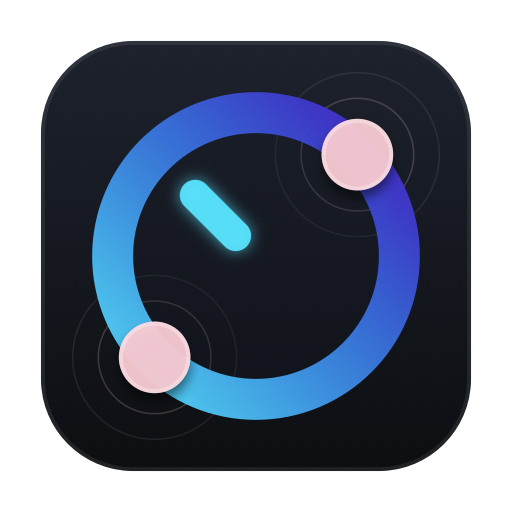

<p align="center">
  <a href="https://benwu232.github.io/PhantomKnob/index_zh.html">
    
  </a>
</p>

<h1 align="center">PhantomKnob 幻影旋钮</h1>

<p align="center">
  <b>解锁封印在 Mac 触控板里的魔法旋钮与便携创意控制台</b><br>
  无需额外硬件，双指轻旋即可隔空调节任意 App 滑块、视频时间轴与调色盘；三指盲调系统音量与外接屏硬件亮度。
</p>

<p align="center">
  <a href="README.md">English</a> |
  <a href="README_zh.md"><b>简体中文</b></a> |
  <a href="https://benwu232.github.io/PhantomKnob/index_zh.html">官方主页</a>
</p>

<p align="center">
  <a href="https://github.com/benwu232/PhantomKnob/releases/"></a>
</p>

<p align="center">
  <a href="https://github.com/benwu232/PhantomKnob/releases/latest"></a>
  
  
  
</p>

---

## 目录 (Table of Contents)

- [✨ 36 秒实机演示视频](#video-demos)
- [🚀 快速开始与安装 (Quick Start)](#quick-start)
- [🎯 三大核心应用场景](#scenes)
  - [1. 系统快捷旋钮 (三指盲调)](#scene-quick-knob)
  - [2. 高频日常应用 (两指旋钮与单指飞轮)](#scene-daily-apps)
  - [3. 移动创意控制台 (剪辑与调色神器)](#scene-pro-console)
- [🛠️ 如何为任意软件定制旋钮](#customize)
- [🔬 底层技术实现原理 (极客深入)](#principles)
- [⚖️ 为什么选择触控板而非实体硬件？](#vs-hardware)
- [💎 免费版 vs Pro 版特性矩阵](#pricing-matrix)
- [🔒 安全与隐私承诺](#security-privacy)
- [❓ 常见问题解答 (FAQ)](#faq)

---

<a id="video-demos"></a>
## ✨ 36 秒实机演示视频

百闻不如一见。通过以下 3 支高清实机演示视频，直观感受触控板模拟物理旋钮的丝滑体验：

| 演示主题 | 时长 | 核心看点 | 视频链接 |
| :--- | :---: | :--- | :---: |
| ⚡ **系统快捷旋钮篇** | 36s | 三指旋转盲调系统音量与屏幕亮度、Space Warp/Rift 炫酷 HUD | [▶ 观看实机演示 (YouTube)](https://youtu.be/sW381I42dwc) |
| 🧭 **高频日常应用篇** | 82s | QuickTime 逐帧变速飞轮卡点与 Safari 双环无级精读漫游 | [▶ 观看日常演示 (YouTube)](https://youtu.be/OO-nl7yFb_A) |
| 🎬 **专业创意工作流篇** | 104s | 剪映 / CapCut 时间轴 CVK 飞轮穿梭与调色文本框悬停盲调 | [▶ 观看工作流演示 (YouTube)](https://youtu.be/EIoTdJ-p-Uo) |

---

<a id="quick-start"></a>
## 🚀 快速开始与安装 (Quick Start)

### 选项 A：终端一键极速安装（推荐）

打开 macOS 终端（Terminal），复制并粘贴运行以下命令：

```bash
curl -fsSL https://raw.githubusercontent.com/benwu232/PhantomKnob/main/install.sh | bash
```

### 选项 B：手动下载 DMG

1. 前往 [GitHub Releases](https://github.com/benwu232/PhantomKnob/releases/) 下载最新的 `PhantomKnob.dmg` 安装包；
2. 打开 DMG，将 `PhantomKnob.app` 拖入 `/Applications`（应用程序）文件夹；
3. 从启动台或应用程序文件夹中双击运行。

### 权限配置与启用

> [!IMPORTANT]
> 首次启动时，macOS 会提示授予两项标准系统权限：
> 1. **辅助功能 (Accessibility)**：用于识别鼠标指针下方悬停的滑块/输入控件，并合成平滑的旋钮调节事件；
> 2. **输入监控 (Input Monitoring)**：仅在双指/三指旋转旋钮处于激活状态时生效，专门捕获 <kbd>C</kbd> 键以调出旋钮管理器与功能热键。
>
> **隐私保证**：我们**绝不常驻监听日常打字**，**绝不记录任何键盘日志**，软件全程 100% 本机离线运行。

授予权限后，点击 macOS 菜单栏中的 **PhantomKnob** 图标，或按下全局热键 <kbd>⌘</kbd> + <kbd>⌥</kbd> + <kbd>K</kbd> 即可启用旋钮（图标变绿即表示就绪）。

---

<a id="scenes"></a>
## 🎯 三大核心应用场景

<a id="scene-quick-knob"></a>
### 1. 系统快捷旋钮 (三指盲调)
*极致体验，高效优雅，零按键干扰*

- **手感盲调**：在触控板左侧三指轻旋调节系统音量，在触控板右侧三指旋转调节显示器亮度。
- **多显示器独立调光**：拥有多台显示器时，亮度旋钮自动根据当前鼠标指针所在的屏幕进行调光。
- **DDC/CI 硬件协议支持 (Pro)**：无需安装第三方繁重工具，直接通过底层 DDC/CI 协议调节第三方外接显示器（如 Dell、LG、ASUS）的真实物理背光。
- **电影级 HUD 视觉特效**：内置 Space Warp、Rift、Halo 等多款 GPU 硬件加速入场与出场动效，兼顾实用与视觉愉悦。

---

<a id="scene-daily-apps"></a>
### 2. 高频日常应用 (两指旋钮与单指飞轮)
*两指旋转如同滚轮，长文浏览与影音快进随心所欲*

- **三种旋钮类型**：
  1. **单旋钮 (Single Knob)**：忠实模拟传统实体旋钮的手感与角位移。
  2. **双环旋钮 (Dual-Ring Knob)**：内环高精微调（0.1x）、外环快速大跳（1.0x），快慢挡随时切换。
  3. **无级变速旋钮 (CVK - Continuous Variable Knob)**：角速度随旋转半径动态变化，越靠外圈旋转阻尼与精度越高，快慢随心。
- **单指飞轮续转 (Pro 专属)**：两指起旋进入调节后，若需长距离滑动，抬起一根手指，用剩余单指围绕虚拟圆心持续 360° 无限旋转，彻底突破手腕生理翻转极限。
- **典型应用**：
  - QuickTime / 播放器：两指轻转快速逐帧定位想要观看的高光片段。
  - Safari / 浏览器：不管是长篇文档、网页小说还是科研论文，顺滑滚轮精确定位阅读位置。

---

<a id="scene-pro-console"></a>
### 3. 移动创意控制台 (剪辑与调色神器)
*便携控制台，先定位后控制，既快速又精准*

- **专为创作 App 深度定制**：针对剪映 / CapCut、Final Cut Pro、DaVinci Resolve、Adobe Lightroom、Logic Pro 等提供专属预设旋钮。检测到前台应用时自动加载匹配方案。
- **时间轴穿梭**：在剪映 / FCP 中，微旋精确卡音频节奏点，大角度快转跨轨道飞梭穿梭。
- **悬停即调心流**：无需用鼠标点击拖拽狭小的数值滑块，只需将鼠标指针悬停在曝光、对比度、HSL、RGB 调色文本框上，直接在触控板上旋转，实现沉浸式盲调。

---

<a id="customize"></a>
## 🛠️ 如何为任意软件定制旋钮

PhantomKnob 拥有极高的自由度，你可以为任何 macOS 应用中的任意控件绑定专属旋钮：


1. **了解控件的受控方式**：
   大部分应用控件可接受**鼠标滚轮**、**上下/左右方向键**或**两指平移**进行微调。通过键盘或滚轮简单测试目标控件响应何种输入。
2. **呼出旋钮管理器**：
   将鼠标悬停在目标控件上，做双指旋转手势，屏幕上出现旋钮 HUD；保持手势或旋转状态下按下键盘上的 <kbd>C</kbd> 键，即可立即唤起「旋钮管理器（Knob Manager）」。
3. **绑定行为与个性化外观**：
   - **行为映射**：指定旋转角度映射为滚轮、方向键或特定快捷键；
   - **外观定制**：为旋钮命名、选择旋钮类型（单旋钮 / 双环 / CVK）、主题颜色、旋转灵敏度以及中心矢量图章。

---

<a id="principles"></a>
## 🔬 底层技术实现原理 (极客深入)

PhantomKnob 是一个深度调用 macOS 底层能力的极客生产力引擎，其核心工作流分为 6 个阶段：

1. **目标控件毫秒级识别**：
   通过系统 Accessibility API（无障碍辅助功能），实时获取鼠标光标所在坐标下的具体 App 层级树与 Slider/TextField UI 元素。
2. **原始触控流拦截与手势解算**：
   在 Multitouch 底层驱动接口中捕获触控板两指/三指绝对物理坐标流。精准计算触点相对几何中心与极坐标夹角变化，并及时消费原始事件，避免触发系统缩放或系统翻页冲突。
3. **参数映射与自适应加权**：
   提取权重最高的触点坐标实时重建几何旋钮模型，根据角度增量与选定算法（线性/非线性/双环）精确折算输出值。
4. **底层事件合成与直接注入**：
   利用 `CGEventPost` 机制将解算出的调节增量合成为系统级键盘方向键、高精度鼠标平滑滚轮或自定义事件流，精准注入 macOS 事件总线。
5. **GPU 硬件加速 HUD 渲染**：
   采用 Metal 与 CoreAnimation 构建极轻量的覆盖渲染图层，HUD 弹出与旋转阻尼全程保持 120Hz ProMotion 刷新率，CPU 占用率几近于 0。
6. **单指飞轮相位补偿算法 (Pro 专属)**：
   当检测到触点由两指降为单指时，算法自动锁定当前虚拟圆心位置，并对单指引入 180° 相位偏置动态修正，确保从双指旋转平滑无缝过渡到单指无限续转。

---

<a id="vs-hardware"></a>
## ⚖️ 为什么选择触控板而非实体硬件？

| 对比维度 | 传统实体控制台 (如 TourBox / 剪辑台) | PhantomKnob 幻影旋钮 |
| :--- | :--- | :--- |
| **出行便携性** | ❌ 重达 300g~800g，背包沉重；易刮蹭磕碰，在高铁、飞机、咖啡馆无法从容展开 | ✅ **零额外硬件，零携带负重**。只需一台 MacBook，随时随地展开专业级工作流 |
| **价格与回报** | ❌ 售价高昂，动辄 $150 ~ $300，专业调色台高达 $600~$2000+，闲置即沉没成本 | ✅ **不足实体硬件 1/10 的买断价格**。彻底压榨你手头几千元 Mac 触控板的硬件潜能 |
| **桌面与接口** | ❌ 长期占用硬件接口，桌面线缆缠绕，无线版还要担心电池续航与硬件磨损老化 | ✅ **零线缆约束，零电池负担**。原生内嵌于系统，开机即用，终身无硬件磨损 |

---

<a id="pricing-matrix"></a>
## 💎 免费版 vs Pro 版特性矩阵

日常高频工具全部永久免费，支持深度定制 5 款专业应用；Pro 版一次性买断，终身解锁无限创作生态与极限手感：

| 功能特性 | 免费版 (Free) | 专业版 (Pro) |
| :--- | :---: | :---: |
| **价格方案** | **$0 / 永久免费** | **$16.18**（原价 $27.18，10/31 前首发优惠） |
| **使用模式** | 个人无限制 | 一次性买断，终身使用，**无任何订阅** |
| **可激活个人 Mac 设备数** | 1 台 | **3 台同时激活** |
| **三指系统快捷旋钮 (音量 / 亮度)** | ✅ 支持 | ✅ 支持 |
| **内置屏与 Apple 官方显示器调光** | ✅ 支持 | ✅ 支持 |
| **第三方外接显示器 DDC/CI 硬件调光** | ❌ | ✅ **独家支持 (Dell/LG/ASUS 等背光调光)** |
| **两指旋转旋钮模拟** | ✅ 支持 | ✅ 支持 |
| **旋钮形态类型** | 支持标准单旋钮 | ✅ **单旋钮 + 双环旋钮 + CVK 无级变速旋钮** |
| **单指飞轮无限续转** | ❌（抬手阻尼刹停） | ✅ **支持（突破手腕物理极限，长程不脱手）** |
| **专业创作 App 深度定制槽位** | 5 款（可随时轮换） | ✅ **无限专业应用生态（彻底解除槽位限制）** |
| **常用日常工具 (Chrome/Safari/VS Code)** | ✅ 终身免配额 | ✅ 终身免配额 |
| **配置与定制同步** | 保存在本地 | ✅ **随个人 iCloud 跨设备自动静默同步** |
| **中心自定义贴图** | 内置 24+ 款 SF Symbols | ✅ **支持从本地导入任意个性化矢量/位图** |
| **定制规则分享** | 本地生效 | ✅ **规则包一键导出与打包分发** |
| **旋钮 HUD 动画特效** | 经典动效 + 每日 10 次体验 | ✅ **尊享全部炫酷动画（持续更新扩充）** |
| **试用与退款保障** | 14 天 Pro 全功能免费体验 | ✅ **14 天无条件全额退款保证** |

👉 **升级渠道**：在已安装的免费版 App 菜单「关于 PhantomKnob…」中可直接一键升级；或前往 [Lemon Squeezy 官方结账通道](https://benwu232.lemonsqueezy.com/checkout/buy/745d4e0d-3c01-4264-bbe2-46ed187ddf10) 选购。

---

<a id="security-privacy"></a>
## 🔒 安全与隐私承诺

- **Apple 官方安全公证 (Notarized)**：PhantomKnob 使用苹果官方开发者证书（Developer ID）签名，每个正式版本在发布前均上传至 Apple 官方服务器进行自动化安全扫描与公证，杜绝任何恶意代码。
- **零按键记录 (Zero Keystroke Logging)**：输入监控权限仅在多指旋转旋钮处于激活状态时用于拦截功能热键与 <kbd>C</kbd> 键。我们绝不常驻监听日常打字，绝不记录任何键入字符与密码。
- **100% 本机离线运行**：软件没有任何远程上报服务端，不收集任何用户交互数据，无用户追踪，无账号注册门槛。

---

<a id="faq"></a>
## ❓ 常见问题解答 (FAQ)

<details>
<summary><b>Q1: 为什么 PhantomKnob 没有上架 Mac App Store？</b></summary>
<br>
PhantomKnob 需要在系统底层监听多点触控板的原始坐标流，并跨应用向全局事件队列注入平滑的滚动与方向控制。Apple 官方 Mac App Store 强制实施的「App 沙盒机制 (App Sandbox)」严格禁止任何第三方软件进行此类底层全局操作（这也是 Raycast、Alfred、BetterTouchTool 等专业 Mac 效率工具无法上架 App Store 的相同技术原因）。
<br><br>
作为替代，PhantomKnob 严格遵循苹果官方开发者公证流程（Apple Notarized），确保应用纯净、安全、经苹果官方认证无恶意篡改。
</details>

<details>
<summary><b>Q2: 为什么双环旋钮的外环旋转速度感觉更慢？</b></summary>
<br>
因为旋钮是依据「角度变化」来控制变量的。半径越大，旋转相同角度时，手指在触控板边缘划过的弧长线速度就越长。因此相同指尖移动距离下，外环对应的角位移更小、感觉更慢，因此外圈天然适合超高精度的微调。当然，在旋钮管理器中，内环与外环的灵敏度和速度完全支持按你的个人直觉自由配置。
</details>

<details>
<summary><b>Q3: 免费版的 5 个专业 App 槽位是怎么计算的？</b></summary>
<br>
日常高频应用（如 Safari、Chrome、VS Code、Xcode、Finder、系统备忘录等）全部免配额且永久免费；针对 Final Cut Pro、剪映 / CapCut、Lightroom、Logic Pro 等专业级创作 App，免费版提供 5 个全功能活跃槽位。第 6 款及以上超量软件仍可免费配置单旋钮，或随时将超量软件调换入 5 个活跃槽位中。如果需要同时管理数十款专业 App 的定制生态，可随时升级 Pro 版。
</details>

<details>
<summary><b>Q4: 我的 Mac 触控板是否兼容？</b></summary>
<br>
所有支持多点触控（Multitouch）的 Mac 触控板均完美兼容，包括所有 MacBook 的内置触控板以及苹果外接妙控板（Magic Trackpad）。软件首次启动时会自动运行触控板硬件兼容性测试。
</details>

<details>
<summary><b>Q5: 如果购买后觉得不适合，支持退款吗？</b></summary>
<br>
支持。我们提供 **14 天无条件退款保证 (14-Day Money-Back Guarantee)**。如果您购买 Pro 版后觉得不符合预期，只需在购买后 14 天内发送邮件至 <a href="mailto:phantomknob232@gmail.com">phantomknob232@gmail.com</a> 并附上您的 Lemon Squeezy 订单号，我们将为您办理全额退款。详见官方主页的<a href="refund.html">退款政策 (Refund Policy)</a>。
</details>

<p align="center">
  <b>方寸之间，掌驭万物。</b><br>
  欢迎前往 <a href="https://benwu232.github.io/PhantomKnob/index_zh.html">PhantomKnob 官方网站</a> 了解更多。
</p>
