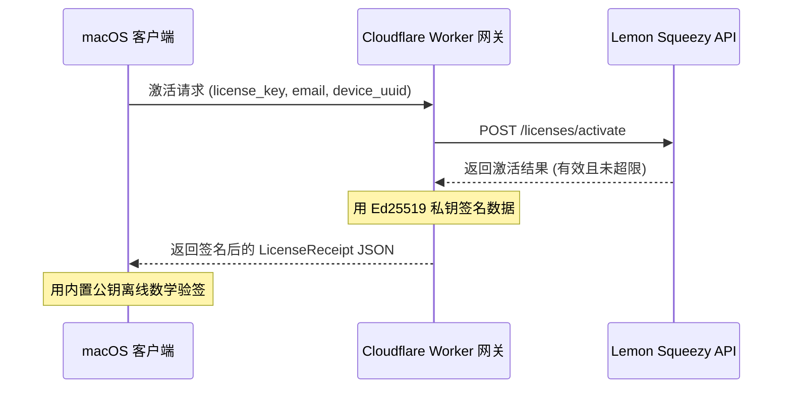

# Cloudflare Worker 许可证校验网关配置指引

本文档详细介绍了如何基于现代 Cloudflare Workers 设计（使用 ES Modules 和 Web Cryptography API）搭建并部署 PhantomKnob 的许可证激活与签名网关。

---

## 1. 系统架构概述

为了保障 Lemon Squeezy 的 API Key 安全，客户端不直接与 Lemon Squeezy 通信，而是通过部署在 Cloudflare 的 Worker 网关进行代理。



---

## 2. 详细配置步骤

### 步骤 1：初始化 Cloudflare Workers 项目

Cloudflare 官方提供命令行工具 `wrangler` 进行开发与部署。

1. 打开终端，进入你的工作目录。
2. 运行项目初始化命令：
   ```bash
   npm create cloudflare@latest phantom-knob-licensing
   ```
   **交互式选择提示指引：**
   - *In which directory...*：输入 `.` （部署在当前文件夹）或默认回车创建同名文件夹。
   - *What type of application...*：选择 **"Hello World" Worker**。
   - *Do you want to use TypeScript?*：选择 **No**（使用 JavaScript 即可）。
   - *Do you want to deploy...*：选择 **No**（编写完代码和配置密钥后再部署）。

项目初始化完成后，主入口为 `src/index.js`。

---

### 步骤 2：生成 Ed25519 签名密钥对

我们需要生成一对符合 Web Cryptography 标准的 Ed25519 公钥和私钥。

在项目根目录下创建一个临时脚本 `generate-keys.js`：

```javascript
// generate-keys.js
const { generateKeyPairSync } = require('crypto');

// 生成 Ed25519 密钥对
const { publicKey, privateKey } = generateKeyPairSync('ed25519');

// 1. 导出 Raw Public Key (用于客户端离线快速校验，32字节Base64)
const rawPubKey = publicKey.export({ format: 'der', type: 'spki' }).slice(12).toString('base64');
console.log("=================== [Swift App 配置] ===================");
console.log("Swift App 原始公钥 Raw Base64 (填入 verifyReceiptOffline 使用)：");
console.log(rawPubKey);

// 2. 导出 PEM Public Key
const pemPubKey = publicKey.export({ format: 'pem', type: 'spki' });
console.log("\nSwift App PEM 格式公钥：");
console.log(pemPubKey);

// 3. 导出 JWK Private Key (必须安全保密！用于配置 Cloudflare Worker 的 Secret)
const privateKeyJwk = privateKey.export({ format: 'jwk' });
console.log("\n=================== [Worker 密钥配置] ===================");
console.log("Cloudflare Worker 环境变量 SIGNING_PRIVATE_KEY_JWK 内容：");
console.log(JSON.stringify(privateKeyJwk));
```

在终端运行此脚本获取密钥信息：
```bash
node generate-keys.js
```
**注意：** 打印输出后，请将公钥与私钥 JSON 串复制安全保存。随后删除该脚本以防私钥泄露：
```bash
rm generate-keys.js
```

---

### 步骤 3：编写 Worker 网关代码 (`src/index.js`)

替换项目中的 `src/index.js` 为以下代码。它实现了 CORS 处理、Lemon Squeezy 接口调用代理以及数字签名生成：

```javascript
// src/index.js

export default {
  async fetch(request, env, ctx) {
    const url = new URL(request.url);
    
    // CORS 跨域头配置
    const corsHeaders = {
      "Access-Control-Allow-Origin": "*",
      "Access-Control-Allow-Methods": "POST, OPTIONS",
      "Access-Control-Allow-Headers": "Content-Type",
    };

    // 响应 CORS 预处理
    if (request.method === "OPTIONS") {
      return new Response(null, { headers: corsHeaders });
    }

    try {
      // ----------------- 1. 许可证激活 -----------------
      if (url.pathname === "/activate" && request.method === "POST") {
        const { license_key, email, device_uuid } = await request.json();
        
        if (!license_key || !email || !device_uuid) {
          return new Response(JSON.stringify({ error: "Missing parameters" }), {
            status: 400,
            headers: { ...corsHeaders, "Content-Type": "application/json" }
          });
        }

        // 调用 Lemon Squeezy 激活 API
        const lsResponse = await fetch("https://api.lemonsqueezy.com/v1/licenses/activate", {
          method: "POST",
          headers: {
            "Accept": "application/json",
            "Content-Type": "application/x-www-form-urlencoded"
          },
          body: new URLSearchParams({
            license_key,
            instance_name: device_uuid
          })
        });

        const lsData = await lsResponse.json();

        if (!lsResponse.ok || lsData.error) {
          return new Response(JSON.stringify({ error: lsData.error || "Activation failed" }), {
            status: 400,
            headers: { ...corsHeaders, "Content-Type": "application/json" }
          });
        }

        // 校验购买邮箱与激活邮箱是否一致
        const customerEmail = lsData.meta.customer_email;
        if (customerEmail.toLowerCase() !== email.toLowerCase()) {
          return new Response(JSON.stringify({ error: "Email mismatch" }), {
            status: 400,
            headers: { ...corsHeaders, "Content-Type": "application/json" }
          });
        }

        const activatedAt = new Date().toISOString();
        const lastVerifiedAt = activatedAt;

        // 与 macOS App 侧验证签名待签明文逻辑严格一致
        const activatedAtSec = Math.floor(new Date(activatedAt).getTime() / 1000);
        const lastVerifiedAtSec = Math.floor(new Date(lastVerifiedAt).getTime() / 1000);
        const message = `${license_key}|${email}|${device_uuid}|${activatedAtSec}|${lastVerifiedAtSec}`;
        
        // 签名
        const signature = await signMessage(message, env.SIGNING_PRIVATE_KEY_JWK);

        const receipt = {
          licenseKey: license_key,
          email: email,
          deviceUUID: device_uuid,
          activatedAt: activatedAt,
          lastVerifiedAt: lastVerifiedAt,
          signature: signature
        };

        return new Response(JSON.stringify(receipt), {
          headers: { ...corsHeaders, "Content-Type": "application/json" }
        });
      }

      // ----------------- 2. 许可证静默刷新校验 -----------------
      if (url.pathname === "/verify" && request.method === "POST") {
        const { license_key, email, device_uuid } = await request.json();
        
        if (!license_key || !email || !device_uuid) {
          return new Response(JSON.stringify({ error: "Missing parameters" }), {
            status: 400,
            headers: { ...corsHeaders, "Content-Type": "application/json" }
          });
        }

        const lsResponse = await fetch("https://api.lemonsqueezy.com/v1/licenses/validate", {
          method: "POST",
          headers: {
            "Accept": "application/json",
            "Content-Type": "application/x-www-form-urlencoded"
          },
          body: new URLSearchParams({ license_key })
        });

        const lsData = await lsResponse.json();

        if (!lsResponse.ok || lsData.error || lsData.license_key.status !== "active") {
          return new Response(JSON.stringify({ error: "License is not active" }), {
            status: 400,
            headers: { ...corsHeaders, "Content-Type": "application/json" }
          });
        }

        const activatedAt = lsData.meta.activated_at || new Date().toISOString();
        const lastVerifiedAt = new Date().toISOString();
        
        const activatedAtSec = Math.floor(new Date(activatedAt).getTime() / 1000);
        const lastVerifiedAtSec = Math.floor(new Date(lastVerifiedAt).getTime() / 1000);
        const message = `${license_key}|${email}|${device_uuid}|${activatedAtSec}|${lastVerifiedAtSec}`;
        
        const signature = await signMessage(message, env.SIGNING_PRIVATE_KEY_JWK);

        const receipt = {
          licenseKey: license_key,
          email: email,
          deviceUUID: device_uuid,
          activatedAt: activatedAt,
          lastVerifiedAt: lastVerifiedAt,
          signature: signature
        };

        return new Response(JSON.stringify(receipt), {
          headers: { ...corsHeaders, "Content-Type": "application/json" }
        });
      }

      // ----------------- 3. 解除激活设备限制 -----------------
      if (url.pathname === "/deactivate" && request.method === "POST") {
        const { license_key, instance_id } = await request.json();
        
        if (!license_key || !instance_id) {
          return new Response(JSON.stringify({ error: "Missing parameters" }), {
            status: 400,
            headers: { ...corsHeaders, "Content-Type": "application/json" }
          });
        }

        const lsResponse = await fetch("https://api.lemonsqueezy.com/v1/licenses/deactivate", {
          method: "POST",
          headers: {
            "Accept": "application/json",
            "Content-Type": "application/x-www-form-urlencoded"
          },
          body: new URLSearchParams({
            license_key,
            instance_id
          })
        });

        const lsData = await lsResponse.json();

        return new Response(JSON.stringify(lsData), {
          headers: { ...corsHeaders, "Content-Type": "application/json" }
        });
      }

      return new Response("Not Found", { status: 404 });
      
    } catch (e) {
      return new Response(JSON.stringify({ error: e.message }), {
        status: 500,
        headers: { ...corsHeaders, "Content-Type": "application/json" }
      });
    }
  }
};

/**
 * Web Cryptography 签名函数 (支持双重 Stringified 的防错解析)
 */
async function signMessage(message, jwkString) {
  let jwk;
  try {
    jwk = typeof jwkString === "string" ? JSON.parse(jwkString) : jwkString;
    // 防御有些终端或脚本在上传 Secret 时带上了外层转义引号，导致第一次 JSON.parse 出来仍是 string
    if (typeof jwk === "string") {
      jwk = JSON.parse(jwk);
    }
  } catch (e) {
    throw new Error("Failed to parse SIGNING_PRIVATE_KEY_JWK: " + e.message);
  }

  const privateKey = await crypto.subtle.importKey(
    "jwk",
    jwk,
    { name: "Ed25519", namedCurve: "Ed25519" },
    false,
    ["sign"]
  );

  const encoder = new TextEncoder();
  const messageBytes = encoder.encode(message);
  
  const signatureBytes = await crypto.subtle.sign(
    { name: "Ed25519" },
    privateKey,
    messageBytes
  );

  // 转为 Base64 签名串返回
  return btoa(String.fromCharCode(...new Uint8Array(signatureBytes)));
}
```

---

### 步骤 4：上传安全凭证 (Secrets) 并部署

通过 Wrangler 命令将涉密的环境变量上传至 Cloudflare（避免硬编码在代码中暴露）：

1. **设置 Lemon Squeezy 的 API 密钥**：
   在终端运行：
   ```bash
   npx wrangler secret put LEMONSQUEEZY_API_KEY
   ```
   提示时粘贴你在 Lemon Squeezy 生成的 API Key。

2. **设置签名私钥 (JWK 格式)**：
   在终端运行：
   ```bash
   npx wrangler secret put SIGNING_PRIVATE_KEY_JWK
   ```
   提示时粘贴在步骤 2 生成的 `SIGNING_PRIVATE_KEY_JWK` 完整 JSON 字符串。

3. **一键部署**：
   在终端运行部署命令：
   ```bash
   npx wrangler deploy
   ```
   部署成功后，你会得到形如 `https://phantom-knob-licensing.xxx.workers.dev` 的网关域名。

---

## 3. macOS App 客户端对接

1. 打开 [LicenseManager.swift](file:///Users/wb/work/phantom_knob_mac/PhantomKnob/Service/LicenseManager.swift)。
2. 将 `lemonSqueezyPublicKeyPEM` 变量更新为步骤 2 导出的 **PEM 格式公钥**。
3. 将激活网络请求的 URL 指向 Cloudflare Workers 部署的域名（例如 `https://phantom-knob-licensing.xxx.workers.dev/activate`）。
