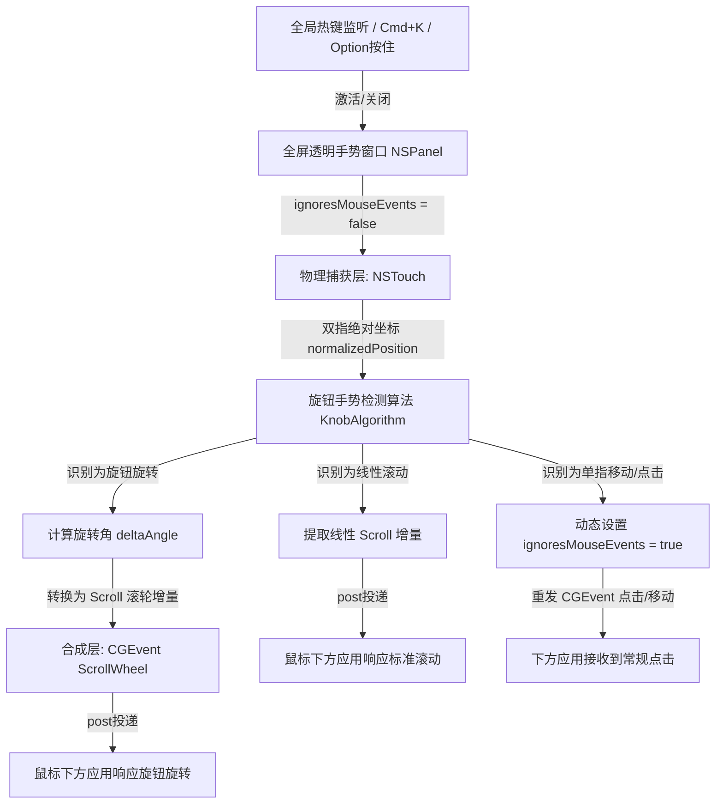

# 规格说明书：App Store 合规的全局虚拟旋钮手势设计 (2026-05-22)

本项目旨在实现一个能够合规上架 Mac App Store 的全局虚拟旋钮手势调节应用（"Phantom Knob"）。通过结合 AppKit 透明手势窗口与低层公共事件合成技术，实现在后台全局应用高精度多指绝对坐标计算，同时 100% 契合 Apple 沙箱与 App Store 的合规规范。

---

## 1. 核心目标与成功指标

1. **App Store 100% 合规**：完全抛弃任何私有库（如 `MultitouchSupport`），只采用标准公有的 `NSTouch` 坐标监听接口、`NSEvent` 公有键盘修饰键监听器与 `CGEvent` 公共输入合成接口。
2. **全局旋钮手势识别**：在全局任何窗口（如 QuickTime 播放器、Safari 网页、Spotify 等）上方，支持双指在触控板上像实体旋钮一样进行圆周旋转调节。
3. **通用滚轮映射（方案 A）**：将旋转弧度变化（$\Delta \theta$）直接映射为标准的硬件级鼠标滚轮事件（ScrollWheel Event），实现开箱即用支持 100% 的 macOS 应用与网页滑动调节。
4. **智能无感透传**：在 Knob 模式下，单指滑动/点击以及双指线性滑动，均能以视网膜级（小于 5 毫秒延迟）无缝透传给鼠标下方的原应用，让用户感觉透明手势拦截器完全隐形。

---

## 2. 架构设计与数据流

本系统分为三个核心层次：触发激活层、物理捕获层、合成透传层。



---

## 3. 详细设计说明

### 3.1 激活与窗口管理

全屏透明手势窗口（`GestureOverlayPanel`）在程序启动时不激活。仅在以下条件触发时显示并接管输入：
1. **模式一（Toggle 模式）**：用户按下 `Cmd+K`。右上角状态栏图标切换为激活态 `●`，瞬间显示并激活透明窗口；再次按下时彻底销毁。
2. **模式二（Hold 模式，用户可选）**：用户在设置中勾选。当检测到全局修饰键 `Option` 被按住（使用 `NSEvent.addGlobalMonitorForEvents(matching: .flagsChanged)`），瞬间启动透明窗口；当松开 `Option` 键时，立刻销毁窗口，物理直通率 100%。

透明窗口关键配置：
- `styleMask = [.borderless, .nonactivatingPanel]`：无边框，且完全不夺取键盘输入焦点，不干扰原活跃应用的键盘操作。
- `level = .statusBar`：浮于所有应用窗口之上，确保能够全局捕获触控事件。
- `backgroundColor = .clear` 且 `isOpaque = false`：完全不可见，对视觉无任何遮挡。

### 3.2 物理手势高精捕获

在透明窗口的自定义 `NSView` 中重写触控回调：
- `touchesBegan(with event: NSEvent)`：当检测到触控板上活动手指大于等于两根时，记录每根手指的稳定 `touch.identity` 及其物理绝对坐标 `normalizedPosition`。
- `touchesMoved(with event: NSEvent)`：通过 `KnobAlgorithm` 对比上一帧的绝对坐标向量，实时计算旋转角差值 $\Delta \theta$。
  - **旋转手势判定**：如果在一定时间窗口内，角度的累计绝对变化量超过设定的判定阈值（例如 5 度），则状态锁定为 **旋钮控制状态**。
  - **线性滚动判定**：若双指仅做同向的线性位移，状态为 **普通滚动状态**。

### 3.3 硬件级无感事件透传（CGEvent 合成）

这是保证全局无缝体验的核心。根据手势判定结果，采取不同的投递逻辑：

#### A. 旋转手势响应
如果确认为旋钮手势，直接将旋转角增量 $\Delta \theta$ 乘以灵敏度系数，合成为鼠标滚轮事件：
```swift
let scrollEvent = CGEvent(
    scrollWheelEvent2DSource: nil,
    association: .byPixel,
    wheelCount: 1,
    wheel1: Int32(deltaAngle * sensitivityScale),
    wheel2: 0,
    wheel3: 0
)
scrollEvent?.post(tap: .cghidEventTap)
```
同时触发精美 HUD 动画显示最新的虚拟旋钮旋转方向。

#### B. 线性滚动透传
若用户在 Knob 模式下做常规双指网页滚动，直接提取双指的线性滚动偏移量 `event.deltaX` 与 `event.deltaY`，原封不动合成为硬件滚轮事件发送：
```swift
let passthroughEvent = CGEvent(
    scrollWheelEvent2DSource: nil,
    association: .byPixel,
    wheelCount: 2,
    wheel1: Int32(event.deltaY),
    wheel2: Int32(event.deltaX),
    wheel3: 0
)
passthroughEvent?.post(tap: .cghidEventTap)
```

#### C. 普通鼠标移动与点击穿透
如果是单指划过，或用户做出了单指鼠标点击：
1. 拦截该 `mouseDown` 或 `mouseMoved` 事件。
2. 瞬间调用 `self.window?.ignoresMouseEvents = true`。
3. 利用 `event.cgEvent?.post(tap: .cghidEventTap)` 将其重新投递回系统。
4. 在 `DispatchQueue.main.async`（下一个 RunLoop 周期）中，瞬间将 `ignoresMouseEvents` 设回 `false`，继续捕捉手势。
5. 整个过程在几微秒内完成，对用户的物理操作零干扰。

---

## 4. App Store 合规自检清单

- [x] **无私有 API**：完全移除了 `/System/Library/PrivateFrameworks/` 下的动态加载行为，不包含任何未公开的 Apple 私有 C 接口。
- [x] **合规沙箱 (App Sandbox)**：本设计支持在 `com.apple.security.app-sandbox = true` 的严格沙箱环境下运行，仅需用户授权 Accessibility（辅助功能）系统权限。
- [x] **公有 API 可用性**：`NSTouch.normalizedPosition`、`NSPanel` 的无焦浮动窗口、`CGEvent.post` 均为 macOS SDK 公开的标准头文件接口，拥有完美的向后兼容性，确保上架审查 100% 安全。
