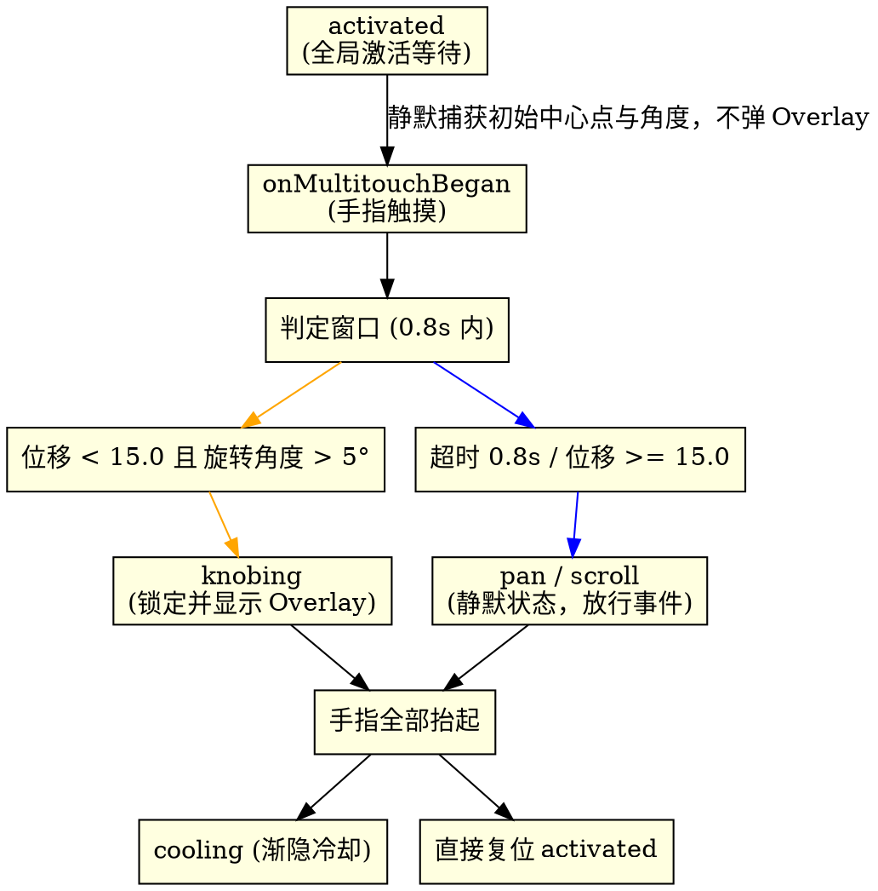

# 2026-06-02 旋钮手势延迟激活判定与 Overlay 优化设计规格说明书 (Deferred Knob Gesture Activation Design Spec)

## 1. 概述与背景 (Overview & Background)

在当前的 `PhantomKnobDetector` 实现中，一旦用户将两根手指放在触控板上，系统便会在 `onMultitouchBegan` 阶段无条件并立即地切入 `.knobing` 状态并弹出 Overlay 提示。

### 1.1 现有局限
这种“即触即弹”的逻辑极大地干扰了用户的日常操作。当用户只是想在触控板上进行普通的“两指滚动 (Scroll)”或“两指横扫 (Swipe)”时，旋钮 Overlay 也会频繁弹出，造成明显的误触。
尤其是左右横向滑动（Swipe Horizontal）时，受人体手部骨骼生理结构限制，手指在平移的瞬间会不可避免地伴随微小的相对扭转，角度容易超过 $5^\circ$，从而误触发旋钮。

### 1.2 升级目标：判定逻辑简化
我们将逻辑简化为：**在两指接触触控板的特定时间窗口（0.8 秒）内，只有当两指中心的位移小于位移阈值，且两指相对旋转的角度变化大于角度阈值时，才激活并进入旋钮手势（`.knob`）。**

具体规则：
1. **触碰静默阶段**：双指首次接触触控板时，静默捕获并缓存初始中心点与角度，**不**弹出 Overlay，**不**锁死光标，事件继续放行。
2. **0.8秒内判定条件**：
   * **中心点位移**：$Distance(Centroid_{current}, Centroid_{initial}) < T_d$ (设定为 15.0，约占触控板尺寸的 15%)。
   * **相对旋转角度**：$Delta(Angle_{current}, Angle_{initial}) > T_a$ (设定为 $5^\circ$)。
   * 当且仅当 **在 0.8 秒内** 以上两个条件同时满足，才切入 `.knob` 状态（显示 Overlay 并锁定光标）。
3. **超时或未满足条件**：若超过 0.8 秒未满足条件，或平移位移超标导致条件不再可能满足，则手势维持 `.pan`（普通滑动）。

---

## 2. 状态转移模型与事件流 (State Machine & Event Flow)



### 2.1 冷却期再触碰逻辑
如果在 Overlay 渐隐冷却（`.cooling`）阶段，用户再次将双指放回触控板：
1. 立即强制停止并失效（`invalidate`）原有的冷却定时器，避免在旋转过程中触发状态重置。
2. 将状态机临时复位至 `.activated`，重新以“静默检测”流程等待新的手势分类。

---

## 3. 详细设计与模块改动 (Detailed Component Changes)

### 3.1 `GestureClassifier.swift` ── 逻辑重构

#### 内部字段：
* `private var initialCentroid: CGPoint?`
* `private let translationThreshold: CGFloat = 15.0`

#### 方法重构：
1. `processTouchesBegan(points:)`
   * 记录 `initialAngle` 与 `initialCentroid = calculateCentroid(points: points)`。
2. `processTouchesMoved(points:)`
   * 检查 `currentMode == .knob`。若为 `true`，直接返回 `.knob`。
   * 检查时间窗口：若 `Date().timeIntervalSince(startTime) > detectionWindow`，则返回 `.pan`。
   * 计算位移距离 `distanceMoved`。
   * 计算角度变化 `delta`。
   * 判断条件：
     ```swift
     if distanceMoved < translationThreshold && delta > angleThreshold {
         currentMode = .knob
     }
     ```
   * 返回 `currentMode`。
3. `processTouchesEnded()`
   * 清空 `initialCentroid = nil`，`initialAngle = nil`，`detectionStartTime = nil`，重置 `currentMode = .pan`。

### 3.2 `KnobStateManager.swift` ── 保持不变
* 维持已实现的延迟判定及静默复位。

---

## 4. 验证与测试方案 (Verification Plan)

### 4.1 单元测试 (Unit Tests)
在 `GestureClassifierTests.swift` 中更新/新增测试用例：
1. **测试判定成功**：双指在 0.5 秒内旋转 8° 且中心位移小于 10，验证返回 `.knob`。
2. **测试超时不激活**：双指在 0.9 秒内旋转 10° 且中心位移小于 10，验证返回 `.pan`。
3. **测试位移超标不激活**：双指在 0.3 秒内旋转 10° 但中心位移达到 20.0，验证返回 `.pan`。

### 4.2 手动功能测试 (Manual Tests)
1. **两指快速滑动**：两指自然快速横向/纵向滑动，确认不弹出 Overlay。
2. **两指原地旋转**：两指原地迅速旋转，确认 Overlay 正常弹出且光标锁定。
3. **静止后旋转**：两指放下静止 1 秒后再旋转，确认 Overlay 不弹出。
