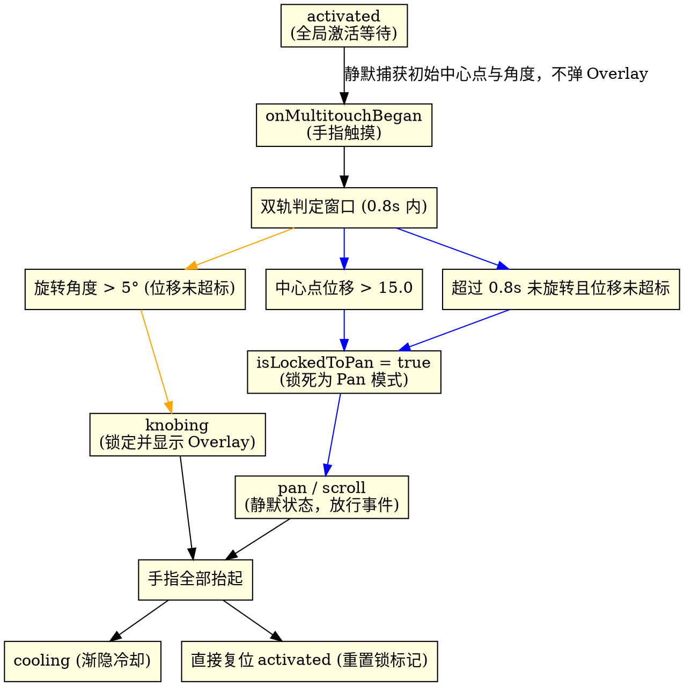

# 2026-06-02 旋钮手势延迟激活判定与 Overlay 优化设计规格说明书 (Deferred Knob Gesture Activation Design Spec)

## 1. 概述与背景 (Overview & Background)

在当前的 `PhantomKnobDetector` 实现中，一旦用户将两根手指放在触控板上，系统便会在 `onMultitouchBegan` 阶段无条件、立即地切入 `.knobing`（正在旋转）状态并弹出 Overlay 提示。

### 1.1 现有局限
这种“即触即弹”的逻辑极立干扰了用户的日常操作。当用户只是想在触控板上进行普通的“两指滚动 (Scroll)”或“两指横扫 (Swipe)”时，旋钮 Overlay 也会频繁弹出并锁定光标，造成非常糟糕的系统级误触体感。
尤其是左右横向滑动（Swipe Horizontal）时，受人体指骨生理结构限制，手指在平移的瞬间会不可避免地伴随微小的相对扭转，在极短时间内（小于0.8秒）角度极易超过 $5^\circ$，导致直接误触发旋钮。

### 1.2 升级目标与方案 A：中心点位移锁死 (Centroid Translation Lockout)
为了彻底解决滑动时的旋转抖动误触，我们引入**中心点位移锁死机制**：
1. **触碰静默阶段**：双指首次接触触控板时，系统在后台计算并缓存目标元素与几何中心，**不**弹出 Overlay，**不**锁死光标，事件继续放行。
2. **0.8秒判定窗口下的双轨竞争**：
   * **位移竞争（拦截）**：计算双指几何中心点 (Centroid) 相比初始中心点的位移。如果在 0.8s 内位移超过了阈值 $T_d$（设定为 15.0，约占触控板尺寸的 15%），则断定为**平移手势（Scroll/Swipe）**，立即将手势永久锁死为 `.pan`，本轮触摸结束前绝不再激活旋钮。
   * **角度竞争（激活）**：如果在位移尚未超过阈值前，双指的相对旋转角度超过了阈值 $T_a$ (设定为 $5^\circ$)，则判定为**旋钮手势（Rotation）**，升级状态为 `.knobing`，锁定鼠标并弹出 Overlay。
3. **超时兜底锁死**：若 0.8 秒内两轨均未判定成功（例如手指静止不动），则超时后手势自动锁死为 `.pan`。

---

## 2. 状态转移模型与事件流 (State Machine & Event Flow)

### 2.1 冷却期再触碰逻辑
如果在 Overlay 渐隐冷却（`.cooling`）阶段，用户再次将双指放回触控板：
1. 立即强制停止并失效（`invalidate`）原有的冷却定时器，避免在旋转过程中触发状态重置。
2. 将状态机临时复位至 `.activated`，重新以“静默检测”流程等待新的手势分类。

---

## 3. 详细设计与模块改动 (Detailed Component Changes)

### 3.1 `GestureClassifier.swift` ── 增加位移判定锁死

#### 内部字段变更：
* `private var initialCentroid: CGPoint?`
* `private var isLockedToPan = false`
* `private let translationThreshold: CGFloat = 15.0`

#### 方法重构：
1. `processTouchesBegan(points:)`
   * 初始化 `initialAngle` 与 `initialCentroid`，清除 `isLockedToPan = false`。
2. `processTouchesMoved(points:)`
   * 检查 `isLockedToPan`。如果为 `true`，直接返回 `.pan`。
   * 计算当前中心点与 `initialCentroid` 的距离。若超过 `translationThreshold`，则设置 `isLockedToPan = true` 并返回 `.pan`。
   * 检查 `Date().timeIntervalSince(startTime) > detectionWindow`。若超时，则设置 `isLockedToPan = true` 并返回 `.pan`。
   * 计算旋转角度。若变化超过 `angleThreshold`，则将 `currentMode` 置为 `.knob`。
3. `processTouchesEnded()`
   * 重置 `isLockedToPan = false`，`initialCentroid = nil`。

### 3.2 `KnobStateManager.swift` ── 延迟流转逻辑 (保持不变)
* **Began 阶段静默化**：只在后台缓存变量，不触发状态流转与 Overlay 弹出。
* **Moved 阶段手势升级**：依赖 `GestureClassifier` 判定。如果返回 `.knob` 且当前状态为 `.activated`，则 transition 为 `.knobing` 并显示 Overlay，同时锁定鼠标位置。
* **Ended 阶段静默复位**：若从未触发 `.knobing`，则静默复位，不弹出 Overlay 且不执行 cooling 渐隐。

---

## 4. 验证与测试方案 (Verification Plan)

### 4.1 单元测试 (Unit Tests)
在 `GestureClassifierTests.swift` 中需要增加/修改测试用例：
1. **测试 0.8s 判定成功**：双指开始移动，并在 0.5 秒内完成了 8° 旋转（且中心点位移小于 15.0），验证返回手势为 `.knob`。
2. **测试 0.8s 超时锁定**：双指开始移动，在 0.9 秒内只平移没有旋转（旋转角度 0°），随后第 1.0 秒模拟进行 10° 旋转，验证返回手势依然锁死为 `.pan`。
3. **测试位移即时锁定**：双指落下，立即在 0.2 秒内横移，位移量达到 20.0（此时旋转角度小于 3°）。随后在该手势内模拟进行 15° 的大范围旋转。验证：返回手势依然为 `.pan`，没有被触发为 `.knob`。

### 4.2 手动功能测试 (Manual Tests)
1. **两指快速横向/纵向滑动测试**：按住 Option 键，两指放上去在触控板上自然地进行快速横向或纵向滑动。验证：**Overlay 完全没有弹出**，系统滚动十分流畅。
2. **旋钮手势激活测试**：两指放上去，立刻原地做旋转动作，验证在旋转初始阶段 Overlay 迅速弹出，并且光标被锁定。
3. **超时锁定测试**：两指放上去静止不转动，等待 1 秒钟，然后开始做旋转动作。验证：Overlay **没有弹出**，手势被锁死。
