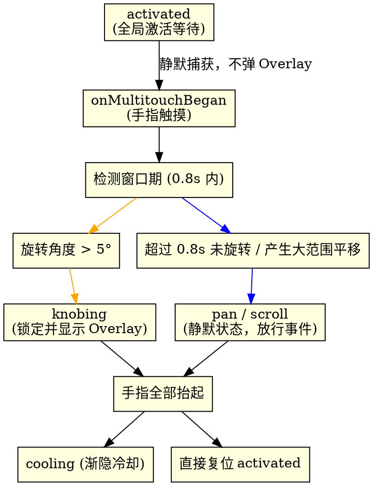

# 2026-06-02 旋钮手势延迟激活判定与 Overlay 优化设计规格说明书 (Deferred Knob Gesture Activation Design Spec)

## 1. 概述与背景 (Overview & Background)

在当前的 `PhantomKnobDetector` 实现中，一旦用户将两根手指放在触控板上，系统便会在 `onMultitouchBegan` 阶段无条件、立即地切入 `.knobing`（正在旋转）状态并弹出 Overlay 提示。

### 1.1 现有局限
这种“即触即弹”的逻辑极大地干扰了用户的日常操作。当用户只是想在触控板上进行普通的“两指滚动 (Scroll)”或“两指横扫 (Swipe)”时，旋钮 Overlay 也会频繁弹出并锁定光标，造成非常糟糕的系统级误触体感。

### 1.2 升级目标
实现一套平滑、自然的**手势延迟激活与锁死判定（Gesture Latching）**机制：
1. **触碰静默阶段**：在双指首次接触触控板时，系统在后台计算并缓存目标元素与几何中心，但不调用 Overlay 显示，也不锁死光标，事件继续放行给系统。
2. **0.8秒判定窗口**：手势分类器的检测窗口从 `2.0 秒` 缩减到更利落的 `0.8 秒`。如果在 0.8 秒内旋转角度超过 5°，则正式激活旋钮锁定，弹出 Overlay。
3. **滑动/横扫防误触锁死**：若手指接触超过 0.8 秒依然没有旋转意图（或双指已提前抬起），该手势被永久钉死为普通的平移/滑动（Pan），在此次手势生命周期中绝不再弹出 Overlay。

---

## 2. 状态转移模型与事件流 (State Machine & Event Flow)



### 2.1 冷却期再触碰逻辑
如果在 Overlay 渐隐冷却（`.cooling`）阶段，用户再次将双指放回触控板：
1. 立即强制停止并失效（`invalidate`）原有的冷却定时器，避免在旋转过程中触发状态重置。
2. 将状态机临时复位至 `.activated`，重新以“静默检测”流程等待新的手势分类。

---

## 3. 详细设计与模块改动 (Detailed Component Changes)

### 3.1 `GestureClassifier.swift` ── 检测窗口缩短
将 `detectionWindow` 阈值从 `2.0` 秒调整为更符合人机工程学响应速度的 `0.8` 秒：
```swift
private let detectionWindow: TimeInterval = 0.8
```

### 3.2 `KnobStateManager.swift` ── 延迟流转逻辑

#### 手势开启 (`onMultitouchBegan`)：
* 停止冷却倒计时，重置 `.cooling` 为 `.activated`。
* 仅仅在后台缓存变量，**不**调用 `transition(to: .knobing)`，**不**显示 Overlay：
  ```swift
  coolingTimer?.invalidate()
  coolingTimer = nil
  if state.isCooling {
      transition(to: .activated)
  }
  // ...缓存 target, translator, initialTouchPosition, fixedCenter, fingerIdx1/2...
  gestureClassifier.processTouchesBegan(points: scaledPoints)
  ```

#### 手势移动 (`onMultitouchMoved`)：
* 每一帧先经过 `gestureClassifier` 的窗口过滤器。当被正式升级为 `.knob` 且当前还是 `.activated` 时，才执行激活操作：
  ```swift
  let mode = gestureClassifier.processTouchesMoved(points: scaledPoints)
  if mode == .knob && !state.isKnobing {
      if let target = currentTarget {
          transition(to: .knobing(target: target))
          if let mouseLoc = initialTouchPosition {
              overlayController.show(
                  at: mouseLoc,
                  targetName: target.displayName.isEmpty ? nil : target.displayName,
                  displayValue: translator.displayValue
              )
          }
      }
  }
  
  if state.isKnobing {
      // 只有在已判定的旋钮状态下才执行 warpCursor 和应用 delta
      if let lockPos = initialTouchPositionCarbon {
          CGWarpMouseCursorPosition(lockPos)
      }
      // ... delta 运算与 translator.apply ...
  }
  ```

#### 手势结束 (`onMultitouchEnded`)：
* 根据当前是否已处于 `.knobing` 状态，分流处理：
  ```swift
  if state.isKnobing, let target = currentTarget {
      transition(to: .cooling(target: target))
      overlayController.fadeOut { [weak self] in
          self?.startCoolingTimer()
      }
  } else {
      // 判定前已松手：静默清除所有本地缓存，直接归位 activated
      transition(to: .activated)
      currentTarget = nil
      currentTranslator = nil
      fixedCenter = nil
      fingerIdx1 = nil
      fingerIdx2 = nil
  }
  ```

---

## 4. 验证与测试方案 (Verification Plan)

### 4.1 单元测试 (Unit Tests)
在 `GestureClassifierTests.swift` 中添加时间窗口和判定的测试用例：
1. **测试 0.8s 判定成功**：双指开始移动，并在 0.5 秒内完成了 8° 旋转，验证返回手势为 `.knob`。
2. **测试 0.8s 超时锁定**：双指开始移动，在 0.9 秒内只平移没有旋转（旋转角度 0°），随后第 1.0 秒模拟进行 10° 旋转，验证返回手势依然锁死为 `.pan`（判定超时锁生效）。

### 4.2 手动功能测试 (Manual Tests)
1. **普通滚动不弹窗测试**：按住 Option 键，两指放上去在触控板上自然地进行上下滚动操作。验证：**Overlay 完全没有弹出**，系统滚动十分流畅。
2. **旋钮手势激活测试**：两指放上去，立刻做旋转动作，验证在旋转初始阶段 Overlay 迅速弹出，并且光标被锁定。
3. **超时锁定测试**：两指放上去静止不转动，等待 1 秒钟，然后开始做旋转动作。验证：Overlay **没有弹出**，表示 0.8 秒超时锁已经成功阻断了手势转换。
