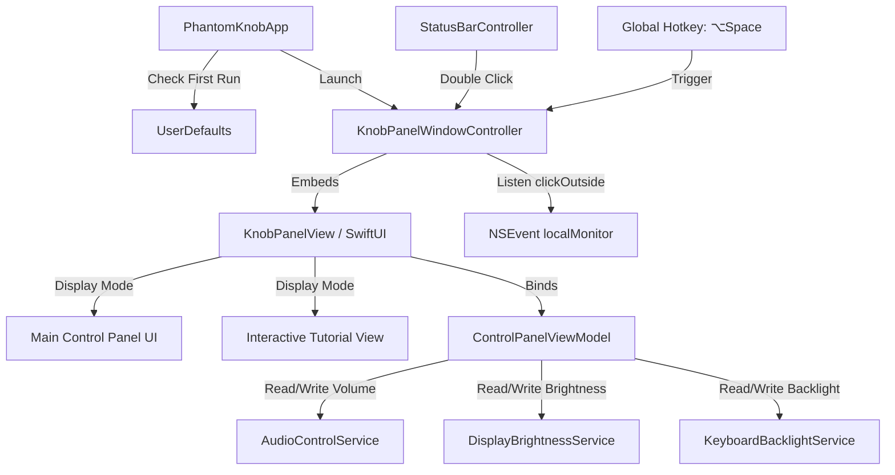

# Phantom Knob 控制面板与新手引导设计方案 (Control Panel & Tutorial Design)

本文档详述了 Phantom Knob 中控制面板（Control Panel，又称 KnobPanel）与交互式新手引导（Tutorial）的设计规格。

---

## 1. 业务目标与用户体验 (Goals & UX Flow)

* **首次启动体验**：应用首次运行检测到未完成新手引导时，自动弹出 KnobPanel 窗口，并进入**交互式 3 步新手引导**。
* **常驻入口**：
  1. **状态栏图标**：单击展示常规菜单，**双击**直接呼出/隐藏 KnobPanel 窗口。
  2. **全局快捷键**：系统级全局热键（默认 `⌥Space`），按下即可呼出/隐藏 KnobPanel。
* **极简退出机制**：当 KnobPanel 弹出后，用户在 **KnobPanel 窗口外部点击鼠标任何地方**，或者 KnobPanel 失去焦点时，窗口自动关闭退出。
* **核心控制项**：提供系统音量 🔊、屏幕亮度 ☀️、键盘背光 ⌨️ 的控制。
* **旋钮联动与悬停放大**：
  * 面板内以**科技拟物旋转圆盘**呈现各个控制变量。
  * **鼠标悬停激活**：当鼠标光标移入某一个变量的圆盘区域时，该圆盘及图标会**平滑放大（Scale Up）**，表示其当前已被激活锁定。
  * **手势控制**：此时用户在触控板上进行两指旋转手势，即可直接调节该激活变量的值，圆盘同步旋转反馈。

---

## 2. 交互与界面设计 (UI/UX Design)

### 2.1 悬停与联动视觉效果 (Hover & Scale Animation)
* 面板采用 **Glassmorphism (毛玻璃) HUD 效果**。
* 包含 3 个旋转圆盘（音量、屏幕亮度、键盘背光），横向并排分布。
* **微动效**：每个圆盘模块绑定 SwiftUI 的 `.onHover` 监听：
  * 悬停时：圆盘整体缩放比从 `1.0` 平滑过渡到 `1.15` (利用 `.spring()` 弹性动画)，外发光高亮（Breath Light）。
  * 离开时：缩放比恢复 `1.0`，发光暗淡。
* 只有当前处于放大（被激活）状态的圆盘，才会接收并响应触控板旋转事件。

### 2.2 交互式新手引导 (Interactive Tutorial)
* **Step 1: 介绍与激活**
  * 引导用户按下快捷键 `⌥Space` 或双击状态栏图标。
* **Step 2: 旋钮手势练习 (必须交互)**
  * 提示用户将鼠标移入某个圆盘（使其放大激活），并使用双指旋转。
  * 用户实际在触控板上旋转满 **360 度** 才能解锁下一步。
* **Step 3: 选择您的偏好并开启体验**
  * 点击“开始使用”，将 `firstRunTutorialCompleted` 写入 `UserDefaults`，关闭引导。

---

## 3. 技术架构与组件设计 (System Architecture)

### 3.1 核心类与职责 (Class Definitions)

#### `KnobPanelWindow` (继承自 `NSWindow`) [NEW]
* 无边框（`NSWindow.StyleMask.borderless`）、透明背景。
* `canBecomeKey` 返回 `true`，使得它能够接收键盘事件和焦点。
* 覆盖 `hidesOnDeactivate = true` 或在失去 Key 状态时自动 `orderOut(nil)` / 关闭。
* 注册局部鼠标事件监听器（`NSEvent.addLocalMonitorForEvents(matching: [.leftMouseDown, .rightMouseDown])`）：当检测到点击发生在窗口 bounds 之外时，关闭窗口。

#### `StatusBarController` [MODIFY]
* 扩展 `setupStatusBar` 中的 `NSButton` 鼠标事件。
* 通过重写或劫持事件，判定 `clickCount == 2`（双击），调用 `KnobPanelWindowController.toggle()`。
* 单击依然保留弹出下拉菜单。

#### `AudioControlService` [NEW]
* 封装 macOS `CoreAudio` API。提供对默认输出音频设备的音量获取与设置。

#### `DisplayBrightnessService` [NEW]
* 封装 `CoreGraphics` / `DisplayServices` 私有 API，或者通过 `IOKit` 获取主显示器的亮度。

#### `KeyboardBacklightService` [NEW]
* 通过 `IOKit` 获取系统键盘背光驱动服务（通常为 `AppleBacklight` / `AppleKeyboardBacklight`）。

---

## 4. 详细数据流与交互流 (Data Flow)

根据控制面板窗口是否可见，手势的路由目标分为两种模式：

### 4.1 窗口开启状态 (Control Panel Focus)
当控制面板窗口显示在屏幕上时，手势优先被控制面板消耗：
* **悬停控制**：当用户的鼠标光标悬停在控制面板的某个圆盘（如“音量”圆盘）上时，该圆盘放大。两指旋转手势直接控制该放大圆盘对应的系统属性。
* **默认/锁定控制**：若鼠标光标未悬停在任何圆盘上，则控制面板默认控制上一次被激活的圆盘（或音量圆盘）。
* **此状态下不再探测背景窗口的滑块或执行页面滚动。**

### 4.2 窗口关闭状态 (Classic Mode)
当控制面板窗口隐藏时，应用行为恢复为原有逻辑：
* 自动探测鼠标光标下方的任何 UI 元素（滑块、进度条、达芬奇色轮等）。
* 若检测到合适的目标则用手势调节目标值；若未检测到目标，则保持原有静默状态或进行默认滚动。

---

## 5. 边界与错误处理 (Edge Cases & Error Handling)

* **多屏或外接显示器亮度**：部分第三方外接显示器不支持 macOS 的原生 DDC 亮度调节。我们将检测是否能够获取显示器亮度，如果失败，在屏幕亮度圆盘上显示“不支持此屏幕”置灰态，并引导用户使用音量或键盘灯。
* **音频输出设备变更**：当拔插耳机或切换蓝牙音箱时，`AudioControlService` 监听 `kAudioHardwarePropertyDefaultOutputDevice` 属性变更，自动重定向到最新的默认输出设备。
* **无辅助功能权限**：若用户未授予 Accessibility 权限，在新手引导的 Step 1 显著位置提示并提供一键跳转系统隐私设置的按钮。

---

## 6. 测试与验证计划 (Testing & Verification)

### 6.1 单元测试 (Unit Tests)
* **`AudioControlServiceTests`**：验证获取与设置音量数值是否在 0.0 - 1.0 范围内正确限幅。
* **`DisplayBrightnessServiceTests`**：验证屏幕亮度接口返回值的正确性。
* **`KeyboardBacklightServiceTests`**：验证键盘背光接口是否存在。
* **`ControlPanelViewModelTests`**：测试新手引导的状态流转，确保 Step 2 旋转满 360 度前无法切换到 Step 3。

### 6.2 手动验证 (Manual Verification)
* 运行应用，如果是第一次启动，确认能立刻弹出控制面板窗口并显示 Tutorial。
* 在 Tutorial Step 2 触控板上两指旋转，确认能实时更新屏幕上的圆盘刻度并解锁“下一步”按钮。
* 双击状态栏图标、按下 `⌥Space` 全局快捷键，确认窗口能够流畅淡入淡出。
* 在控制面板外部任意地方点击，确认窗口能够立刻关闭消失。
* 鼠标悬停在三个圆盘上时，确认能平滑放大 1.15 倍，且手势旋转仅改变当前放大的圆盘对应的属性。
