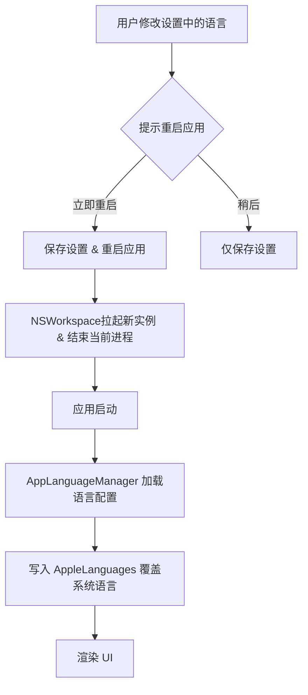

# 2026-07-03 语言选择设置设计文档

本文档描述在 PhantomKnob 设置中添加简体中文/英文语言切换选项的技术实现方案。

## 需求说明

为支持 PhantomKnob 的出海和本地化体验，需要在设置（Settings）的常规（General）选项卡中增加一个语言切换的下拉菜单。

- **支持语言**：系统默认 (System Default)、English、简体中文
- **生效方式**：修改设置后弹出提示，通过自动重启应用来刷新所有组件（包含状态栏 `NSMenu` 等非 SwiftUI 组件）的本地化字符串。

## 设计方案

### 1. 语言管理器 `AppLanguageManager`

负责管理语言的读取、写入，应用语言覆盖（通过 `AppleLanguages`）以及实现无缝重启逻辑。

- **文件路径**：`PhantomKnob/Service/AppLanguageManager.swift` [NEW]
- **语言枚举**：
  - `system`: "system" (跟随系统)
  - `english`: "en"
  - `chinese`: "zh-Hans"

### 2. 启动加载与应用

为了保证本地化文件加载时被覆盖，必须在 `@main` 结构体的 `init()` 中进行最早的拦截。

- **文件路径**：`PhantomKnob/App/PhantomKnobApp.swift` [MODIFY]
- **改动**：在 `PhantomKnobApp.init()` 中调用 `AppLanguageManager.shared.applyLanguageOverrideOnStartup()`。

### 3. 设置页面 UI

在常规设置面板中，添加一个新的“语言”配置区块。

- **文件路径**：`PhantomKnob/View/SettingsView.swift` [MODIFY]
- **改动**：在 `GeneralSettingsView` 的 `body` 中增加一个 Section，内部包含 Picker 组件绑定到 `AppLanguageManager`，在值变化时执行弹窗逻辑。

### 4. 本地化资源映射

- **文件路径**：`PhantomKnob/Localizable.xcstrings` [MODIFY]
- **新增键值**：
  - `language.system`: "System Default" / "系统默认"
  - `settings.section.language`: "Language" / "语言设置"
  - `settings.language.title`: "Language" / "语言"
  - `settings.language.alert.title`: "Change Language" / "切换语言"
  - `settings.language.alert.message`: "PhantomKnob must restart to apply the new language settings. Would you like to restart now?" / "需要重新启动 PhantomKnob 才能应用新的语言设置。是否立即重启？"
  - `settings.language.alert.restartNow`: "Restart Now" / "立即重启"
  - `settings.language.alert.later`: "Later" / "稍后"

## 验证计划

1. **功能测试**：
   - 切换语言为“English”，点击立即重启，确认整个应用（含状态栏菜单）变成英文。
   - 切换语言为“简体中文”，点击立即重启，确认变成中文。
   - 切换语言为“系统默认”，确认与 macOS 系统语言一致。
   - 切换语言后选择“稍后”，确认重启前语言不变，手动重启应用后生效。
2. **测试用例**：
   - 增加 `AppLanguageManagerTests` 测试获取与设置逻辑。
