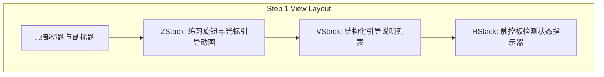

# 2026-07-06 用户指南第一页布局与文案重构设计文档

本文档描述重构用户指南（User Guide）第一页布局与文案的技术实现方案，将说明文字移到音量练习旋钮下方，并采用更清晰的列表项展现。

## 需求说明

为优化用户的入门引导体验，需要调整用户指南中第一页（设备检测与简单旋钮）的布局顺序与文本展示形式：
1. **布局调整**：音量练习旋钮（Volume Practice Dial）置于顶部偏上区域，详细说明文案与操作指导放置在旋钮下方。
2. **文本结构化**：操作指南由原来的段落长文本形式修改为分步列表项形式，以便用户一目了然地快速阅读。
3. **中英双语同步**：对中文与英文版做同步改动，保证界面的专业度与统一性。

## 设计方案

### 1. 布局重构

在 `UserGuideView.swift` 的 `step1View` 中调整组件的顺序。



### 2. 界面与组件设计

在 `UserGuideView.swift` 中：
- 调整 `step1View` 内部子视图的垂直排序。
- 新增 `bulletItem` 私有辅助视图函数，用于高保真地渲染列表圆点与文本：
  ```swift
  private func bulletItem(text: String) -> some View {
      HStack(alignment: .top, spacing: 6) {
          Text("•")
              .foregroundColor(.blue)
              .font(.system(size: 13, weight: .bold))
          Text(text)
              .font(.system(size: 12))
              .foregroundColor(.white.opacity(0.8))
              .fixedSize(horizontal: false, vertical: true)
      }
  }
  ```
- 说明列表区块将拥有精细的半透明背景、微弱的边框以及圆角处理，以提升视觉高级感（卡片化设计）：
  - 背景色：`Color.white.opacity(0.03)`
  - 边框：`Color.white.opacity(0.05)`，圆角 `8`

- **文件路径**：`PhantomKnob/View/UserGuideView.swift` [MODIFY]

### 3. 本地化字符资源更新

对 `Localizable.xcstrings` 进行修改，移除原有的 `guide.step1.description` 键值对，新增如下更细粒度的段落和步骤字符串。

- **文件路径**：`PhantomKnob/Localizable.xcstrings` [MODIFY]
- **新增键值对**：
  - `guide.step1.intro`:
    - 中文："请在触控板上练习使用旋钮手势："
    - 英文："Please practice using the knob gesture on your trackpad:"
  - `guide.step1.step1`:
    - 中文："在系统设置 / 隐私与安全 / 辅助功能里为 PhantomKnob 授权"
    - 英文："Grant accessibility permission to PhantomKnob in System Settings > Privacy & Security > Accessibility."
  - `guide.step1.step2`:
    - 中文："移动鼠标到音量练习旋钮上"
    - 英文："Move the cursor onto the volume practice dial."
  - `guide.step1.step3`:
    - 中文："用两指接触触控板，并做旋转动作"
    - 英文："Touch the trackpad with two fingers and perform a rotation gesture."
  - `guide.step1.footer`:
    - 中文："系统将检测硬件是否支持旋钮手势；如果支持，执行旋钮手势，您将看到旋钮旋转并听到音量变化。"
    - 英文："The system will detect whether your hardware supports knob gestures; if supported, you will see the dial rotate and hear the volume change."

## 验证计划

### 1. 视觉与排版校验
- 启动应用或点击“打开使用引导”，校验第一页的排版是否符合：旋钮在上，列表在下，状态指示在最下方。
- 圆点对齐、文本包裹正常（无截断、无溢出）。
- 切换语言至英文，验证英文翻译和版式是否同样精美。

### 2. 交互逻辑校验
- 鼠标在旋钮上悬停、移开，光标提示手势动画是否能正确触发和隐去。
- 进行两指旋转，检验系统检测流程（0/3 样本收集）是否一切如常，音量增减与 Tink 提示音播放均无异常。
