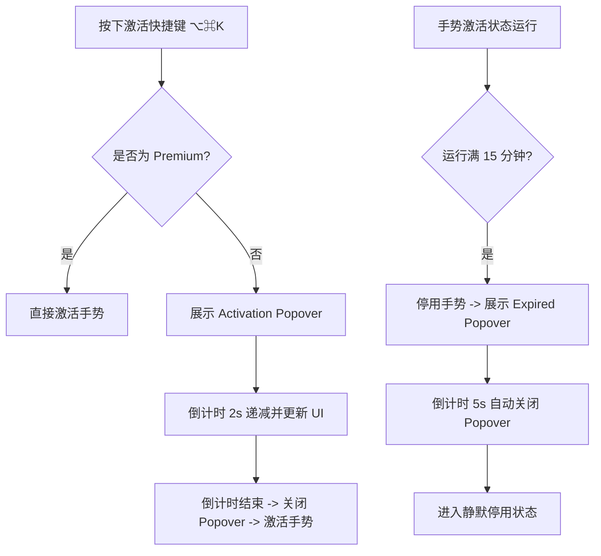

# Free Edition HUD Reminders Design Specification

This document details the design and implementation plan for adding NSPopover-based HUD notifications to the Free Edition of PhantomKnob. This includes a countdown bubble during the 2-second activation delay and a deactivation notification bubble when the 15-minute session limit expires.

---

## 1. Goals (设计目标)

1. **消除激活等待挫败感 (Count down Activation Delay)**:
   * 当免费版用户激活手势时，在状态栏图标正下方弹出一个精美的 NSPopover 气泡。
   * 气泡内显示 “Free Edition” 标识与 `"正在初始化手势环境..."` 字样，附带动态加载环和 2 秒倒计时。
   * 倒计时结束手势进入激活状态后，气泡自动消失。
2. **解决静默退出困惑 (Inform Session Expiry)**:
   * 当免费版 15 分钟会话倒计时结束、手势自动断开时，立即在状态栏图标正下方弹出到期提示气泡。
   * 提示气泡内显示 `"免费版会话到期"`，并说明这是 15 分钟限制，引导用户按快捷键重新开启。
   * 气泡底部提供“升级至专业版”链接，点击后直接拉起设置窗口的 “About” 界面。
   * 气泡在展示 5 秒后自动关闭。
3. **保留专业调性 (Maintain Premium Aesthetic)**:
   * 气泡采用 macOS 原生的毛玻璃半透明材质，配合精细的 SVG 图标（锁/时钟）和深色渐变设计。
   * 气泡位置精确悬浮于状态栏图标正下方，不遮挡屏幕中央的生产力工作区。

---

## 2. Detailed Design (详细设计)

### 2.1 交互流程设计



### 2.2 气泡视窗实现 (FreeEditionPopover)
* 创建 SwiftUI 视图 `FreeEditionPopoverView.swift` 渲染内容：
  * 支持两种状态模型：
    ```swift
    enum FreePopoverMode {
        case activating(secondsRemaining: Double)
        case sessionExpired(onUpgrade: () -> Void)
    }
    ```
  * 状态渲染细节：
    * **`activating`**:
      * 标题: "Free Edition" (橘色小字，大写字母间距拉开)
      * 中部: 圆形加载环 (ProgressView) + "正在准备手势环境..."
      * 底部: "N秒" 倒计时大字 (系统青色 `.cyan`)
    * **`sessionExpired`**:
      * 标题: "Free Edition" (红色小字)
      * 中部: 锁图标 🔒 + "会话时限到期 (15m)" + "免费版手势已自动断开。您可以按 ⌥⌘K 重新激活。"
      * 底部: "获取专业版解锁无限时 ➔" (青色下划线按钮)
* 在 `StatusBarController` 中持有 `NSPopover` 实例：
  * 气泡样式设置：`behavior = .transient` (失焦自动关闭)，但在倒计时期间，可能需要防失焦关闭。
  * 定位锚点：`statusItem?.button`，弹出方向为 `.minYEdge` (下方)。

### 2.3 状态关联逻辑
* **[KnobStateManager.swift](file:///Users/wb/work/phantom_knob_mac/PhantomKnob/Service/KnobStateManager.swift)**:
  * 激活延迟触发时，更新 `StatusBarController` 中的激活倒计时。
  * 会话倒计时到期时，执行停用，并调用 `StatusBarController` 的到期提示方法。
* **[StatusBarController.swift](file:///Users/wb/work/phantom_knob_mac/PhantomKnob/Service/StatusBarController.swift)**:
  * 提供 `showFreeActivatingPopover(seconds:)` 和 `showFreeExpiredPopover()` 方法。
  * 提供倒计时的内部定时器，或者由 `KnobStateManager` 驱动。推荐由 `KnobStateManager` 里的时间驱动以保证状态绝对一致。

---

## 3. Proposed Changes (拟议变更)

### 3.1 Components & Files

#### [NEW] [FreeEditionPopoverView.swift](file:///Users/wb/work/phantom_knob_mac/PhantomKnob/View/FreeEditionPopoverView.swift)
* 实现免费版专用的 Popover UI 视图，利用 SwiftUI 丰富的美学特性定制发光边框、加载环和排版。

#### [MODIFY] [StatusBarController.swift](file:///Users/wb/work/phantom_knob_mac/PhantomKnob/Service/StatusBarController.swift)
* 引入 `NSPopover` 管理气泡的生命周期与显示位置。
* 编写显示/更新气泡的代码，以及点击升级链接时触发 settings 页面切换。

#### [MODIFY] [KnobStateManager.swift](file:///Users/wb/work/phantom_knob_mac/PhantomKnob/Service/KnobStateManager.swift)
* 在倒计时及超时阶段接入气泡唤醒通知。

---

## 4. Verification Plan (验证计划)

### 4.1 Automated Tests
* 编写 `FreeEditionPopoverTests.swift`，测试不同模式下 Popover 内部数据状态转换的正确性。
* 运行项目已有测试，确认状态机逻辑无破坏：
  `xcodebuild test -project PhantomKnob/PhantomKnob.xcodeproj -scheme PhantomKnob`

### 4.2 Manual Verification (手动验证)
1. **测试激活延迟气泡**：在免费版状态下按下快捷键，确认状态栏图标正下方立即弹出倒计时气泡，倒计时数字每秒递减，且加载环处于旋转动画中。倒计时结束后气泡准时消失。
2. **测试超时断开气泡**：模拟将 15 分钟超时缩短为 5 秒，启动激活。5 秒后手势自动退回非激活状态，且状态栏图标正下方弹出红色“时限到期”气泡，提示文本正确，且在 5 秒后自动渐隐消失。
3. **测试升级入口链接**：点击到期气泡中的“获取专业版解锁无限时”按钮，验证其是否能自动拉起 Settings 窗口的 “About” 标签页。
