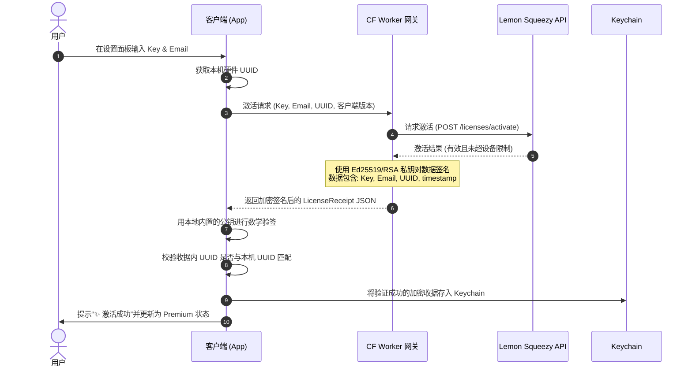

# 规格说明书：基于 Lemon Squeezy 的混合许可证验证与付费转化设计

本文档详述了 PhantomKnob 独立站分发版本中，基于 Lemon Squeezy 支付渠道的混合授权校验（License Verification）机制、云端签名网关设计以及多入口付费转化交互流程。

---

## 1. 核心目标

1. **防篡改与高安全性**：废除现有的本地 Mock 逻辑，通过云端签名网关对 Lemon Squeezy API 进行签名，客户端使用非对称加密公钥离线校验收据，防止通过 Hosts 屏蔽或本地 Mock 简单破解。
2. **无缝离线体验**：在首次激活后，冷启动采用 100% 离线验签，网络波动和短期断网绝不打扰用户。
3. **安全防一码多用**：网关在云端校验 Lemon Squeezy 的激活设备数，并将授权与本机的硬件 UUID 绑定，防止激活码在网络上公开传播滥用。
4. **精细化转化漏斗**：在状态栏菜单、过期气泡、设置面板等三大核心触点嵌入购买入口。针对试用期用户，在天数小于 3 天时在状态栏菜单精准推荐购买按钮，兼顾商业转化与用户体验。

---

## 2. 系统架构与数据流

本系统由 **Cloudflare Worker 签名网关** 与 **App 客户端 LicenseManager** 配合实现。

### 2.1 整体数据流向



---

## 3. 详细设计说明

### 3.1 激活收据与存储 (`LicenseReceipt`)
在 `LicenseManager.swift` 中定义全新的 `LicenseReceipt` 结构：
```swift
struct LicenseReceipt: Codable {
    let licenseKey: String
    let email: String
    let deviceUUID: String      // 绑定本机的硬件 UUID
    let activatedAt: Date
    let lastVerifiedAt: Date    // 上次成功在线刷新的时间
    let signature: String       // 云端网关私钥签发的 Base64 签名串
}
```
* **安全存储**：激活成功后，收据使用 `KeychainHelper` 以 `"com.phantomknob.licenseReceipt"` 为 Key 加密持久化。
* **硬件 UUID 获取**：使用标准的 IOKit 公有接口获取 Mac 的 `IOPlatformUUID`，确保唯一性且沙箱合规。

### 3.2 离线校验与冷启动逻辑
1. **App 启动**：`LicenseManager` 初始化时，同步/异步读取 Keychain。
2. **本地公钥验签**：App 使用内置的数字签名公钥（与网关的私钥成对），对 `LicenseReceipt` 中的 `(licenseKey + email + deviceUUID + activatedAt + lastVerifiedAt)` 明文与 `signature` 进行验签。
3. **硬件匹配验证**：比对当前 Mac 硬件 UUID 是否等于收据中的 `deviceUUID`。
4. **验证结论**：
   * *验签且硬件匹配通过*：`currentState` 立即置为 `.licensed`，开放全部 Pro 功能。
   * *任一校验失败*：本地清除无效收据，降级回 `.free` 或 `.trialing`。

### 3.3 静默后台刷新与 7 天宽限期 (Grace Period)
为了应对退款、被商家拉黑或吊销的 Key：
1. **静默刷新判定**：App 启动或运行时，若发现 `lastVerifiedAt` 距离当前时间已超过 **15 天**，则在后台线程静默启动网络刷新。
2. **刷新网络请求**：向 CF Worker 网关发送校验请求。
   * *网关明确返回 License 被禁用/退款*：本地立刻清除收据，退回到 `.free` 并全局发送通知。
   * *网络请求失败（无网/超时/DNS 错误）*：App **不**立即吊销授权。在本地启动一个 **7 天的宽限期** 倒计时。宽限期内，App 保持 `.licensed` 状态，每天在后台重试一次刷新。若 7 天后仍无法连接成功，则暂时降级至 `.free`。

### 3.4 状态栏菜单 (Status Bar Menu) 付费引导细节
根据用户的授权状态，状态栏菜单 (`StatusBarController.swift`) 动态调整呈现内容：

```
1. 处于 14 天试用期 (Trialing)：
   ┌─────────────────────────────────────────┐
   │ ✦ 试用期: 还剩 10 天                    │
   │ ...                                     │
   └─────────────────────────────────────────┘

2. 处于试用期临界状态 (Trialing, 剩余天数 < 3 天)：
   ┌─────────────────────────────────────────┐
   │ ✦ 试用期: 还剩 2 天                     │
   │ 🛒 购买专业版 (Buy Premium)...          │  <-- 动态新增
   │ ...                                     │
   └─────────────────────────────────────────┘

3. 处于免费版 (Free Edition)：
   ┌─────────────────────────────────────────┐
   │ ✦ 许可证: 免费版                        │
   │ 🛒 升级到专业版 (Get Premium)...         │  <-- 常驻
   │ ...                                     │
   └─────────────────────────────────────────┘
```
* **点击事件**：点击购买选项，系统通过 `NSWorkspace.shared.open()` 调起浏览器，访问 `https://phantomknob.com#buy`。

### 3.5 设置面板与激活交互 (`SettingsView.swift`)
* **激活中状态**：输入 Email 与 Key 后，点击“Activate”按钮时：
  * 展示 `ProgressView` 旋转动画。
  * 输入框和按钮均设为 `.disabled` 防止重复提交。
* **错误反馈**：
  * 密码错误或超限：红字提示 `“❌ 授权码无效或已在其他设备激活”`。
  * 网络错误：提示 `“⚠️ 网络连接失败，请稍后重试”`。
* **成功与解除激活**：
  * 成功后展示庆祝对勾，界面切换为 Licensed 状态卡片。
  * 提供 `Deactivate` 按钮，点击弹窗确认后调用网关释放设备数，本地擦除 Key。

---

## 4. 拟议变更文件

### 4.1 [MODIFY] [LicenseState.swift](file:///Users/wb/work/phantom_knob_mac/PhantomKnob/Model/LicenseState.swift)
* 补充 LicenseState 关联的只读属性，用于状态栏文本的本地化和天数读取。

### 4.2 [MODIFY] [LicenseManager.swift](file:///Users/wb/work/phantom_knob_mac/PhantomKnob/Service/LicenseManager.swift)
* 重写 `currentState` 的校验逻辑，接入非对称加密校验（CryptoKit）。
* 实现后台静默刷新定时器、7 天宽限期计数器。
* 编写获取 Mac UUID 及绑定验证的方法。

### 4.3 [MODIFY] [StatusBarController.swift](file:///Users/wb/work/phantom_knob_mac/PhantomKnob/Service/StatusBarController.swift)
* 动态构建状态栏菜单项：
  * 判断 `daysRemaining < 3` 时追加 `Buy Premium`。
  * 处于 `.free` 状态时，常驻 `Upgrade to Premium`。

### 4.4 [MODIFY] [SettingsView.swift](file:///Users/wb/work/phantom_knob_mac/PhantomKnob/View/SettingsView.swift)
* 更新 `About/License` 标签页，实现加载状态、成功庆祝、错误反馈的毛玻璃美学 UI。

---

## 5. 验证计划

### 5.1 自动化测试
* 编写 `LicenseVerificationTests.swift`，测试以下逻辑：
  * 伪造的 Signature 是否会被公钥正确拦截。
  * 修改本地 UUID 后，已验证的 Receipt 是否会失效。
  * 宽限期天数递减与降级的边界条件。

### 5.2 手动验证流程
1. **试用期菜单联动测试**：
   * 将试用开始时间模拟修改为 12 天前（剩余 2 天），打开状态栏菜单，确认能看到 `🛒 购买专业版...`。
   * 将试用时间模拟修改为 5 天前（剩余 9 天），打开菜单，确认只显示剩余天数，**不展示**购买按钮。
2. **一码多用/激活测试**：
   * 在网关配置限制最多激活 2 台设备。使用该 Key 在第 3 台设备（或模拟不同 UUID）上激活，验证是否提示激活超限错误。
3. **退款/拉黑降级测试**：
   * 在 Lemon Squeezy 中对测试 Key 进行 Deactivate 或退款，触发客户端刷新，验证 App 能否在后台静默刷新后自动降级为 `.free`，并且弹出到期气泡。
