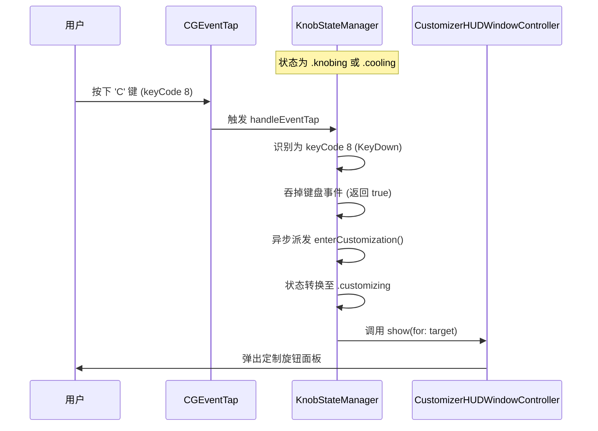

# 旋转中按 C 键触发旋钮定制设计规格说明 (Knob Customization C-Key Trigger)

本规格说明定义了在旋转旋钮（`knobing` 状态）或冷却期间（`cooling` 状态）按下 `c` 键触发弹出定制旋钮面板的设计细节与 TDD 验证方案。

## 背景与目的

为了方便用户在调整旋钮属性时能快速对当前旋钮进行个性化设置，应用支持在手势旋转过程中通过按下键盘上的 `c` 键直接弹出 Customizer HUD（定制旋钮面板）。
为了确保这一触发链路的稳定性，需要为该逻辑编写单元测试，并使用 TDD 方式验证其正确性。

## 详细设计

### 1. 拦截与状态转换链路



### 2. 接口调整

在 `KnobStateManager.swift` 中：
- 将 `private func handleEventTap(proxy: CGEventTapProxy, type: CGEventType, event: CGEvent) -> Bool` 调整为：
  ```swift
  func handleEventTap(proxy: CGEventTapProxy?, type: CGEventType, event: CGEvent) -> Bool
  ```
  使外部测试目标能直接进行事件方法调用。

## 单元测试设计

### 新测试文件：`PhantomKnobTests/KnobCustomizationTriggerTests.swift`

- **测试用例**：`testCKeyTriggerCustomizationDuringKnobing`
- **逻辑步骤**：
  1. 实例化 `KnobStateManager`。
  2. 构造一个虚拟的 `DetectedTarget` 并设置到状态机。
  3. 将状态机转换到 `.knobing(target: target)` 状态。
  4. 构造 `c` 键（keycode = 8）的 `keyDown` 事件。
  5. 调用 `manager.handleEventTap(proxy: nil, type: .keyDown, event: event)`，并断言其返回 `true`（表示已拦截吞掉）。
  6. 通过 `XCTestExpectation` 等待主线程异步队列派发完成。
  7. 断言 `manager.state` 转换为 `.customizing`。
  8. 断言 `CustomizerHUDWindowController.shared.isVisible` 为 `true`。
  9. 清理：在 `tearDown` 或测试结束时，调用 `CustomizerHUDWindowController.shared.hide()` 隐藏面板。

## TDD 验证计划

### 1. 红灯阶段（Red）
- 修改 `handleEventTap` 接口访问控制，并**临时注释掉** `handleEventTap` 内部对键码 `8`（'C'）的拦截处理。
- 运行测试命令：
  ```bash
  xcodebuild test -workspace PhantomKnob/PhantomKnob.xcodeproj -scheme PhantomKnobTests -destination 'platform=macOS'
  ```
  或者使用 package 测试（需要正确指定 testTarget）：
  ```bash
  xcodebuild test -scheme PhantomKnob -destination 'platform=macOS'
  ```
- 验证测试红灯（失败），且失败原因为状态未转变、面板未显示。

### 2. 绿灯阶段（Green）
- 还原并启用 `handleEventTap` 对键码 `8` 的拦截和派发逻辑。
- 再次运行测试，验证全部绿灯通过。
