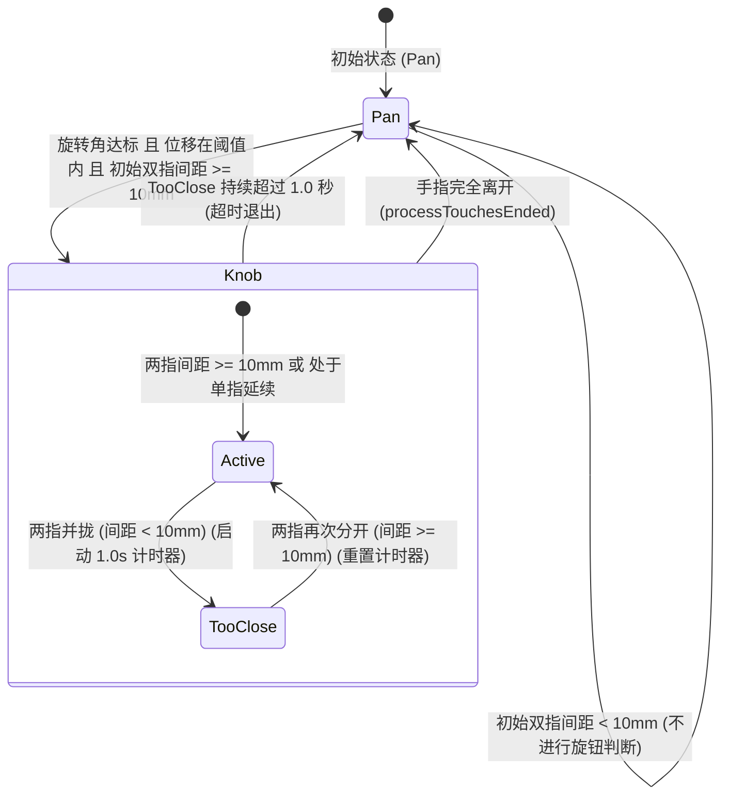

# 双指距离小于10mm避错与超时退出设计规格说明 (Knob Finger Distance Filter)

本规格说明定义了当两指物理距离小于10mm时，避免判定为旋钮，以及旋钮期间如果两指距离小于10mm持续超过1秒则自动退出旋钮（避免误判）的设计细节与测试验证方案。

## 背景与目的

Phantom Knob 利用触控板上的双指手势来模拟旋钮旋转。然而，在日常使用中，如单指或双指滚动、双手打字误触、手指极近距离挪动等场景下，容易产生旋钮误识别。
为了解决该误判问题：
1. **落指严格校验**：在落指那一刻（`processTouchesBegan`）强制要求双指间距 $\ge 10\text{ mm}$，否则不进行旋钮判定。
2. **移动渐进容错**：在已激活旋钮的状态下，考虑到用户在旋转过程中可能会暂时将手指靠拢，不应立即退出旋钮。我们设定一个 1.0 秒的缓冲计时器，如果双指持续靠拢（间距 $< 10\text{ mm}$）超过 1.0 秒，则退出旋钮状态并淡出 Overlay，以防长久的靠拢导致后续无意旋转引发误调节。同时，单指延续状态由于不具备双指间距，需自动绕过此校验。

## 详细设计

### 1. 拦截与状态转换链路



### 2. 接口与逻辑变更

#### A. `GestureClassifier.swift`

- 新增成员属性：
  ```swift
  private let minDistanceThreshold: CGFloat = 10.0 // 最小旋钮距离阈值 (mm)
  private var closeDistanceStartTime: Date?       // 记录两指小于 10mm 的开始时间
  ```

- 修改 `processTouchesBegan(points:)`：
  ```swift
  func processTouchesBegan(points: [Int: CGPoint]) {
      // 只有双指及以上且最大物理间距大于等于 10mm 时才启动判定
      let (knobCore, _, _) = algorithm.calKnob(points)
      if knobCore.isValid && knobCore.radius * 2 >= minDistanceThreshold {
          initialAngle = knobCore.angle
          initialCentroid = calculateCentroid(points: points)
          detectionStartTime = Date()
      } else {
          initialAngle = nil
          initialCentroid = nil
          detectionStartTime = nil
      }
      closeDistanceStartTime = nil
      currentMode = .pan
  }
  ```

- 修改 `processTouchesMoved(points:) -> GestureMode`：
  ```swift
  func processTouchesMoved(points: [Int: CGPoint]) -> GestureMode {
      if currentMode == .knob {
          if points.count >= 2 {
              let (knobCore, _, _) = algorithm.calKnob(points)
              let currentDistance = knobCore.isValid ? knobCore.radius * 2 : 0
              if currentDistance < minDistanceThreshold {
                  if closeDistanceStartTime == nil {
                      closeDistanceStartTime = Date()
                  } else if Date().timeIntervalSince(closeDistanceStartTime!) >= 1.0 {
                      // 持续 1.0s 小于 10mm，降级回 .pan，并重置定位基准以允许在同一次触摸中重新激活
                      currentMode = .pan
                      closeDistanceStartTime = nil
                      initialAngle = calculateAngle(points: points)
                      initialCentroid = calculateCentroid(points: points)
                      detectionStartTime = Date()
                  }
              } else {
                  closeDistanceStartTime = nil
              }
          } else {
              // 单指延续状态，不需要距离校验，重置计时器
              closeDistanceStartTime = nil
          }
          return currentMode
      }
      
      // 未进入 knob 状态时的判定逻辑保持原样
      guard let initialAngle = initialAngle,
            let initialCentroid = initialCentroid,
            let startTime = detectionStartTime else {
          return currentMode
      }
      
      if Date().timeIntervalSince(startTime) > detectionWindow {
          return .pan
      }
      
      let currentCentroid = calculateCentroid(points: points)
      let distanceMoved = distance(initialCentroid, currentCentroid)
      
      let currentAngle = calculateAngle(points: points)
      let delta = abs(angleDelta(from: initialAngle, to: currentAngle))
      
      if distanceMoved < translationThreshold && delta > angleThreshold {
          // 在激活前，再次确保当前双指距离 >= 10mm
          let (knobCore, _, _) = algorithm.calKnob(points)
          let currentDistance = knobCore.isValid ? knobCore.radius * 2 : 0
          if currentDistance >= minDistanceThreshold {
              currentMode = .knob
          }
      }
      
      return currentMode
  }
  ```

#### B. `KnobStateManager.swift`

在 `onMultitouchMoved(points:)` 遍历中，在已是 `isKnobing` 状态时，校验手势分类器的输出：
```swift
        // 🌟 进行手势判定是否升级为 knob
        let mode = gestureClassifier.processTouchesMoved(points: points)
        
        if state.isKnobing {
            if mode != .knob {
                // 两指靠拢超时，触发退出
                PKLogger.knob.debug("Exiting knobing early because gesture mode is no longer .knob (distance filter timeout)")
                if let target = currentTarget {
                    transition(to: .cooling(target: target))
                    if target.axRole != "ControlPanel" {
                        overlayController.fadeOut { [weak self] in
                            self?.startCoolingTimer()
                        }
                    } else {
                        startCoolingTimer()
                    }
                } else {
                    transition(to: .activated)
                }
                return
            }
            
            // ... 原有的旋转与注入事件逻辑 ...
        }
```

## 单元测试设计

在 `GestureClassifierTests.swift` 中新增测试：

### 1. `testBeganDistanceFilter`
- **步骤**：
  1. 构造双指，距离为 8.0 mm（小于 10.0）。
  2. 调用 `processTouchesBegan`。
  3. 模拟双指无位移，且旋转了 15 度（达标）。
  4. 调用 `processTouchesMoved`。
  5. 期望返回 `.pan`（不应判定为 `.knob`）。

### 2. `testKnobDistanceTimeout`
- **步骤**：
  1. 构造双指，距离为 20.0 mm，调用 `processTouchesBegan`。
  2. 模拟旋转 15 度，调用 `processTouchesMoved`.
  3. 验证返回 `.knob`。
  4. 保持旋转，但将双指距离收缩至 8.0 mm。
  5. 模拟小幅度滑动，且等待大于 1.0 秒。
  6. 再次调用 `processTouchesMoved`。
  7. 期望返回 `.pan`（退回普通手势状态）。

## TDD 验证计划

### 1. 红灯阶段 (Red)
- 创建测试用例至 `GestureClassifierTests.swift`。
- 运行测试，期望由于尚未实现距离过滤逻辑，新测试报错失败。

### 2. 绿灯阶段 (Green)
- 依次实现 `GestureClassifier.swift` 与 `KnobStateManager.swift` 逻辑。
- 重新运行测试，期望全部测试通过。
