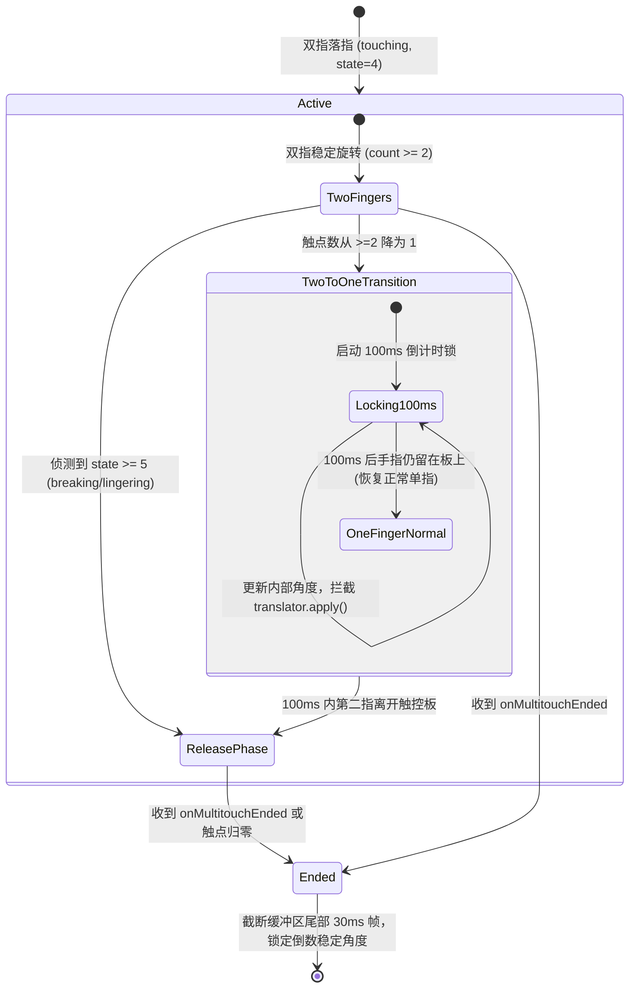

# 双指离板触点防拉扯与防抖过滤设计规格说明 (Knob Liftoff Jitter Filter v2)

本规格说明定义了当用户使用妙控板（Magic Trackpad）进行旋钮手势旋转并抬起指尖离板时，如何通过**底层触点状态过滤（State-Based Filtering）**、**双指切单指 100ms 锁定（100ms Transition Protection Lock）**以及**末帧角度冻结（Tail Freezing）**组合策略，彻底消除指尖离开瞬间坐标突变引发的旋转增量倒退和拉扯现象。

## 背景与问题根因

在旋钮手势交互中，仅仅在 `onMultitouchEnded`（手指全离板）时更正角度变量依然会导致跳动，主要源于以下三个根因：
1. **已发送系统事件无法撤回**：在 `onMultitouchMoved` 触发的每一帧中，角位移增量已经通过 `translator.apply(...)` 实时派发交给了 macOS 系统（如键盘快捷键、音量调整或鼠标滚轮）。在离板前发生的跳变导致错误事件已被执行。
2. **双指切单指的时间差与坐标系错位**：抬手瞬间两指难以绝对同步离开（通常相差 5~30ms）。当一指先离开时，系统短暂切入单指模式，计算公式由“双指中点夹角”突变为“单指对固定中心的夹角”，产生极大的角度阶跃（Angle Jump）。
3. **离板前肌腱放松的物理微回弹**：抬手前夕速度衰减，指尖微摩擦产生逆向小幅位移。

---

## 详细设计

### 1. 整体架构与链路

### 2. 核心模块与职责

#### A. `MultitouchManager.swift` (底层触点状态判定)
- 检查 `MTContact.state`（4: touching, 5: breaking, 6: lingering）。
- 手势进行中若存在 `state == 5` 或 `state == 6` 的离板过渡触点，自动暂停分发 `onMultitouchMoved`。

#### B. `KnobStateManager.swift` (双指切单指 100ms 锁定 & 低速反弹过滤)
- **100ms 切换保护锁 (100ms Transition Protection)**：
  - 新增 `transitionToOneFingerTime: Date?` 和 `previousPointCount: Int`。
  - 当检测到触点数从 `≥ 2` 降为 `1` 的瞬间，记录 `transitionToOneFingerTime = Date()`。
  - 在随后的 **100ms** 时间窗口内：继续更新内部 `currentAngle` 与 Overlay UI，但**全面拦截派发给操作系统的 `translator.apply(...)` 事件**。
  - 若 100ms 内收到 `onMultitouchEnded`（手指全离板），则成功拦截消融了抬手差引致的错误跳变。
  - 若 100ms 后手指依然留在板面上滑动，清空锁定，恢复正常单指派发。
- **低速与反向回弹过滤 (Low-Velocity & Reversal Filter)**：
  - 计算实时角速度 $\omega$。在滑动末期极低速状态下出现小于 $2^\circ$ 的瞬时反向脉冲时，跳过系统事件派发。
- **末帧角度冻结 (Tail Freezing)**：
  - 维护 30ms 角度滑动历史缓冲区 `KnobAngleBuffer`，在 `Ended` 时回滚至稳定值。

---

## 规格自检 (Spec Self-Check)

- **占位符检查**：无 TODO 或待定需求。
- **内部一致性**：明确定义了 100ms 切换锁机制、时序与 `translator.apply(...)` 拦截逻辑。
- **范围检查**：精准聚焦于消除离板增量派发泄漏与角度跳跃问题。

---

## 验证计划

### 1. 单元测试 (`KnobLiftoffFilterTests.swift`)
- **测试 1：100ms 双切单事件拦截验证**
  - 模拟双指滑动时第 1 指离开，在 50ms 内第 2 指也离开，验证没有派发任何 `translator` 系统事件。
- **测试 2：100ms 后单指延续恢复验证**
  - 模拟第 1 指离开 150ms 后第 2 指继续滑动，验证 100ms 之后恢复系统事件派发。
- **测试 3：底层触点 state 5/6 与尾帧 30ms 回滚测试**

### 2. 真机验证
- 旋转旋钮并随手抬起指尖，确认音量、滚轮或快捷键触发没有多余反弹。
