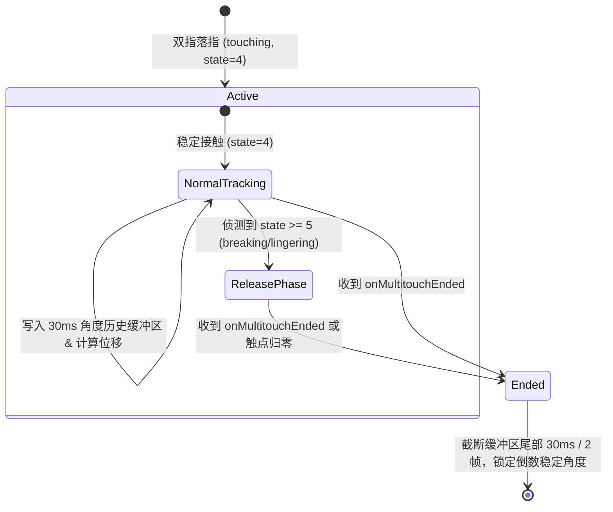

# 双指离板触点防拉扯与防抖过滤设计规格说明 (Knob Liftoff Jitter Filter)

本规格说明定义了当用户使用妙控板（Magic Trackpad）进行旋钮手势旋转并抬起指尖离板时，如何通过**底层触点状态过滤（State-Based Filtering）**与**末帧角度冻结（Tail Freezing）**组合策略，消除指尖离开瞬间坐标突变引发的旋转增量倒退和拉扯现象。

## 背景与目的

在日常使用 Phantom Knob 旋转虚拟旋钮时，用户抬起双指离开妙控板的瞬间，触点坐标经常会出现瞬时偏移。这种偏移是由以下原因共同作用造成的：
1. **电容重心几何偏移**：指腹接触面在抬起瞬间急剧缩小并向指尖边缘脱离。
2. **信噪比（SNR）急剧下降**：离开前最后一刻注入的电信号衰减，感应精度降低。
3. **固件平滑算法截断**：触控板固件在侦测到离开趋势时会退出长窗口平滑滤波。
4. **macOS 触点状态切换**：`MTContact.state` 在脱离阶段由 `4 (touching)` 转换至 `5 (breaking)` 和 `6 (lingering)`。

为了防止离板瞬间的坐标突变导致旋钮数值反向“拉扯”或微跳动，需要设计一套兼顾低延迟与高平滑度的离板防抖过滤机制。

---

## 详细设计

### 1. 整体架构与链路



### 2. 核心模块与职责

#### A. `MultitouchManager.swift` (底层触点状态判定)
- 在接收到 `MTContact` 阵列时，检查每个触点的物理状态 `contact.state`：
  - `state == 4`: 表示 `touching`（稳定触碰状态）。
  - `state == 5`: 表示 `breaking`（手指正在断开接触）。
  - `state == 6`: 表示 `lingering`（残留接触）。
- 在手势运行期间 (`inGesture == true`)：
  - 若检测到活动触点中出现 `state == 5` 或 `state == 6`，标志该帧进入离板过渡期 (`isReleasePhase = true`)。
  - `MultitouchManager` 在 `isReleasePhase == true` 时，跳过将该帧的抖动坐标推送到 `onMultitouchMoved`，避免脏数据污染。

#### B. `KnobStateManager.swift` / `GestureClassifier.swift` (历史帧缓冲区与倒退防拉扯)
- 维护一个时间限制为 30ms / 最多 3 帧的角度历史缓冲区 `angleHistoryBuffer`：
  ```swift
  struct AngleFrame {
      let angle: Double
      let timestamp: Date
  }
  ```
- **末帧冻结（Tail Freezing）算法**：
  - 在手势正常推进时，每一帧的角度与时间戳均追加至 `angleHistoryBuffer`（保持最多 3 帧）。
  - 当收到手势结束事件（`onMultitouchEnded`）或离板事件时，强制丢弃过去 30ms / 2 帧内的角度变化量，旋钮最终保留在倒数第 2/3 帧计算出的稳定角度值上。

---

## 边界条件与容错

1. **慢速旋转微调**：
   在极慢速转动旋钮时，30ms 历史帧内的角度变化小于精度阈值（$< 0.5^\circ$），回滚操作不会造成任何视觉跳跃。
2. **单指延续模式 (One-Finger Continuation)**：
   当用户从双指转换为单指时，第一指抬起的瞬间同样会触发防拉扯处理，确保单指延续模式启动时的基准角度平滑稳定。
3. **不同刷新率硬件兼容**：
   缓冲区同时受 **帧数（最多 3 帧）** 与 **时间（最多 30ms）** 双重约束，确保在 60Hz 和 120Hz 的 Trackpad 设备上行为一致。

---

## 规格自检 (Spec Self-Check)

- **占位符检查**：无 TODO 或待定需求。
- **内部一致性**：架构图、状态机与组件变更说明一致。
- **范围检查**：专注于解决触点离板抖动问题，范围明确且适合一个实现计划覆盖。
- **模糊性检查**：已明确定义 `state` 的具体枚举值 (5/6) 和缓冲截断的具体时间阈值 (30ms / 2 帧)。

---

## 验证计划

### 1. 单元测试 (`KnobLiftoffFilterTests.swift`)
- **测试 1：底层触点状态过滤验证**
  - 构造包含 `state = 5 (breaking)` 和 `state = 6 (lingering)` 的模拟 `MTContact` 数据包，验证 `MultitouchManager` 是否正确阻止向 `delegate` 发送离板数据。
- **测试 2：角度缓冲区尾帧截断验证**
  - 模拟包含尾帧反向跳动的角度数据流（例如：`[0°, 10°, 20°, 18°]`），触发手势结束，验证 `KnobStateManager` 结算的最终角度是否为稳定帧 `20°` 而非反弹帧 `18°`。

### 2. 手动/真机验证
- 快速旋转旋钮并迅速抬手，确认面板上的旋钮指示器及音量/数值 HUD 没有发生反向跳动。
