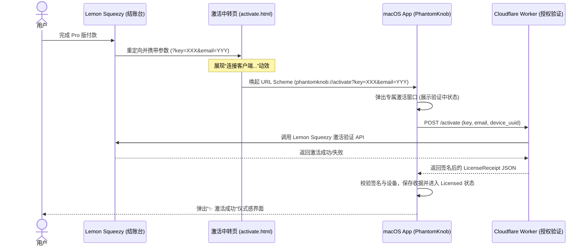

# 2026-08-01 PhantomKnob 购买与激活流程简化设计规格说明书

本文档定义了将 PhantomKnob 许可证购买与激活流程进行深度简化、实现“一键零输入激活”的设计规格。该设计通过注册自定义 URL 协议（Deep Link）、构建专属的激活/升级 UI 窗口、以及集成网页端自动唤起中转页，大幅降低用户购买后的配置摩擦。

---

## 1. 目标与成功标准

* **零输入一键激活**：用户在官网完成购买后，无需手动复制和粘贴购买邮箱与许可证密钥（License Key），仅需点击网页端一键激活按钮（或自动跳转）即可完成 App 授权。
* **独立的 Pro 升级与激活窗口**：将激活/购买流程从偏好设置面板（Settings View）中剥离，在状态栏菜单中提供独立的 Pro 升级入口与定制化的高级感 UI 界面。
* **高可用性与兜底机制**：在自动跳转失效或非 Mac 环境下，网页端和 App 端均提供清晰的手动激活引导（如一键复制密钥与手动输入表单）。

---

## 2. 架构设计与状态流转

### 2.1 整体时序与数据流


---

## 3. 详细设计

### 3.1 客户端自定义 URL 协议拦截与路由
#### 3.1.1 `Info.plist` 协议注册
在 `PhantomKnob/Info.plist` 中配置 `CFBundleURLTypes`，注册 `phantomknob` 协议：
```xml
<key>CFBundleURLTypes</key>
<array>
    <dict>
        <key>CFBundleURLName</key>
        <string>com.phantomknob.url-scheme</string>
        <key>CFBundleURLSchemes</key>
        <array>
            <string>phantomknob</string>
        </array>
    </dict>
</array>
```

#### 3.1.2 App 级事件监听与解析 (`URLSchemeHandler.swift`)
新建类 `URLSchemeHandler`，用于在 App 初始化时拦截并解析 Apple 事件：
```swift
import AppKit
import Foundation

class URLSchemeHandler {
    static let shared = URLSchemeHandler()
    
    func startListening() {
        NSAppleEventManager.shared().setEventHandler(
            self,
            andSelector: #selector(handleGetURLEvent(_:withReplyEvent:)),
            forEventClass: AEEventClass(kInternetEventClass),
            andEventID: AEEventID(kAEGetURL)
        )
    }
    
    @objc private func handleGetURLEvent(_ event: NSAppleEventDescriptor, withReplyEvent replyEvent: NSAppleEventDescriptor) {
        guard let urlString = event.paramDescriptor(forKeyword: keyDirectObject)?.stringValue,
              let url = URL(string: urlString) else {
            return
        }
        parseAndTriggerActivation(url: url)
    }
    
    private func parseAndTriggerActivation(url: URL) {
        // 匹配格式: phantomknob://activate?key=XXX&email=YYY
        guard url.host == "activate" else { return }
        
        let components = URLComponents(url: url, resolvingAgainstBaseURL: true)
        let key = components?.queryItems?.first(where: { $0.name == "key" })?.value
        let email = components?.queryItems?.first(where: { $0.name == "email" })?.value
        
        if let key = key, let email = email {
            // 打开专属激活窗口，并填充数据执行激活
            DispatchQueue.main.async {
                LicenseWindowController.shared.show()
                NotificationCenter.default.post(
                    name: NSNotification.Name("TriggerLicenseActivationFromURL"),
                    object: nil,
                    userInfo: ["key": key, "email": email]
                )
            }
        }
    }
}
```

---

### 3.2 专属激活窗口与交互 UI
#### 3.2.1 窗口控制器 (`LicenseWindowController.swift`)
[NEW] 新建类负责生命周期，行为包括：
* 尺寸固定为 `480x360`，居中，无边框设计（磨砂 HUD 背景风格）。
* 应用失去焦点时可根据 Pinned 状态决定是否隐退。

#### 3.2.2 视图设计 (`LicenseWindowView.swift`)
[NEW] 新建 SwiftUI 视图，管理激活过程中的三种状态：
1. **未激活状态 (Free / Trial)**：
   * 展示 Pro 核心特权。
   * 提供大颗粒度、金黄色渐变的“立即获取 Pro 授权”按钮。
   * 底置小折叠表单提供“邮箱”与“授权码”输入框，支持手动粘贴。
2. **激活中状态 (Verifying)**：
   * 禁用所有输入，显示圆环加载指示器，文本提示“正在安全激活 Pro 权限...”。
3. **已激活状态 (Licensed)**：
   * 展示精致勾选动效（由灰度转为金色并伴随粒子飘落效果）。
   * 谢谢致词，显示脱敏后的激活邮箱 `u***r@example.com`。
   * 提供“解绑此设备”按钮。

---

### 3.3 状态栏菜单与路由重构 (`StatusBarController.swift`)
* 将原有 `buyPro` 方法改为唤醒专属激活窗口：
  ```swift
  @objc func buyPro() {
      LicenseWindowController.shared.show()
  }
  ```
* 移除偏好设置面板 `SettingsView` 中的激活输入框与按钮。原 Settings 中的 About Tab 只保留纯文本版块。

---

### 3.4 网页端一键激活与主页适配 (在分发仓库 `PhantomKnob` 中)
#### 3.4.1 主页购买链接与文案调整 (`index_zh.html` & `index.html`)
* 更新“购买许可”按钮链接为 Lemon Squeezy 真实的结账台链接。
* 在结账台完成页（Checkout Success）配置重定向到：
  `https://benwu232.github.io/PhantomKnob/activate.html?key={license_key}&email={customer_email}`。
* 在主页 Pro 版优势清单中添加：“⚡️ 零输入一键激活：付款后自动唤醒客户端完成授权，无需手动复制激活码。”

#### 3.4.2 [NEW] 一键激活中转页 (`activate.html`)
新建此页面，具有暗黑、微光科技感：
* **核心脚本**：
  ```javascript
  window.onload = function() {
      const params = new URLSearchParams(window.location.search);
      const key = params.get('key') || params.get('license_key');
      const email = params.get('email');
      
      if (key && email) {
          document.getElementById('key-display').textContent = key;
          document.getElementById('email-display').textContent = email;
          
          // 自动唤起 App
          const schemeUrl = `phantomknob://activate?key=${encodeURIComponent(key)}&email=${encodeURIComponent(email)}`;
          window.location.href = schemeUrl;
          
          // 配置按钮点击事件
          document.getElementById('activate-btn').onclick = function() {
              window.location.href = schemeUrl;
          };
      } else {
          document.getElementById('status-text').textContent = "未检测到有效的许可证参数";
      }
  };
  ```
* 提供一键复制 License Key 和一键复制 Email 的备用按钮，以防 Deep Link 被拦截或在非 Mac 设备上打开。

---

## 5. 验证计划

### 5.1 自动化与单元测试
* 在 `LicenseManagerTests.swift` 中为静默激活和在线激活流程增加相关数据结构解析验证。
* 编写 URL 解析测试案例，验证 `URLSchemeHandler` 能够正确提取 URL 参数。

### 5.2 手动与集成验证
1. **自定义 URL 协议拉起验证**：
   * 在 Terminal 中运行 `open "phantomknob://activate?key=TEST_KEY&email=test@example.com"`。
   * 预期：PhantomKnob 客户端自动弹出 `480x360` 专属激活窗口，显示激活数据，并尝试联网验证。
2. **网页跳转验证**：
   * 在本地浏览器打开带有测试参数的 `activate.html`。
   * 预期：浏览器提示是否打开 PhantomKnob，确认后拉起 App 激活。
