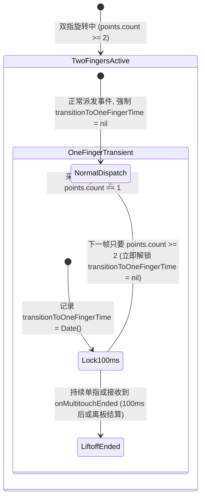

# 旋钮双指归位即时解锁 100ms 锁设计规格说明 (Knob Protection Lock Instant Unlock Design Spec)

本规格说明定义了如何通过在 `KnobStateManager` 中实现**双指归位即时解锁 100ms 保护锁**，彻底解决双指旋转过程中由于瞬时触点数波动导致的延迟与迟滞问题。

---

## 背景与问题根因

在旋钮手势交互中，用户在双指转动（包括改变方向减速）时，经常遇到突发的迟滞感。代码排查确定了最核心的根因：

- **100ms 保护锁在双指恢复后仍强行拦截**：
  在 [KnobStateManager.swift](file:///Users/wb/work/phantom_knob_mac/PhantomKnob/Service/KnobStateManager.swift#L796-L809) 中，当触控板采样瞬间出现 `points.count == 1` 时，触发了 `transitionToOneFingerTime = Date()`。
  即便是因为转动减速或轻触导致的 1 帧短暂误判，且在随后下一帧双指即重新归位（`points.count >= 2`），`transitionToOneFingerTime` 变量**未被清除**，导致系统强制拦截接下来的整整 100ms 内部的所有 `translator.apply(...)` 事件派发。

---

## 详细设计

### 1. 交互与解锁时序



---

### 2. 核心模块变更

#### `KnobStateManager.swift` (双指归位即时解锁)
- 修改 `onMultitouchMoved(points:)`：
  ```swift
  func onMultitouchMoved(points: [Int: CGPoint]) {
      let currentTouchCount = points.count
      if currentTouchCount >= 2 {
          // 双指只要处于板面上，立即解锁 100ms 保护锁，防止瞬时单指误判封锁后续旋转
          transitionToOneFingerTime = nil
      } else if previousPointCount >= 2 && currentTouchCount == 1 {
          // 仅在真实出现双切单时，记录 100ms 保护锁起始时间
          transitionToOneFingerTime = Date()
          PKLogger.knob.debug("Two-to-one finger transition detected, starting 100ms protection lock")
      }
      previousPointCount = currentTouchCount
      
      // 后续逻辑保持不变...
  }
  ```

---

## 规格自检 (Spec Self-Check)

- **占位符检查**：无 TODO 或未完成描述。
- **内部一致性**：明确限定仅修改 A (`KnobStateManager.swift` 保护锁解除)，保持 Translator 累加器与 Classifier 间距阈值不变。
- **范围检查**：精准聚焦于解决 100ms 保护锁假死拦截问题。

---

## 验证计划

### 1. 单元测试 (`KnobLiftoffFilterTests.swift`)

- **测试 1：双指归位即时解锁验证**
  - 构造模拟触点点阵：第 1 帧双指（count=2），第 2 帧单指（count=1，设置 `transitionToOneFingerTime`），第 3 帧恢复双指（count=2）。
  - 验证在第 3 帧时，`transitionToOneFingerTime` 被清空为 `nil`，且 `translator.apply(...)` 事件能够正常派发而不被 100ms 锁拦截。

### 2. 真机验证
- 使用 Magic Trackpad 进行旋钮旋转与方向切换，确认双指正常留在板上时不再出现突发的 100ms 卡顿。
