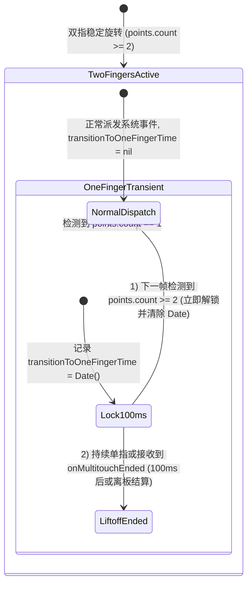

# 旋钮换向迟滞修复与跟手度优化设计规格说明 (Knob Responsiveness & Reversal Filter Design Spec)

本规格说明定义了如何修复在旋钮改变旋转方向（顺时针/逆时针切换）时出现的明显迟滞感与不跟手问题，通过**双指归位即时解锁 100ms 保护锁**、**InputTranslator 换向累加器即时清空**以及**双指间距阈值修正 (20mm -> 10mm)** 组合策略，消除反向死区并提升旋钮响应跟手度。

---

## 背景与问题根因

在实际使用中，用户在改变旋转方向时感到明显迟滞，主要源于以下三个根因：

1. **100ms 保护锁的“假死”残留**：在 [KnobStateManager.swift](file:///Users/wb/work/phantom_knob_mac/PhantomKnob/Service/KnobStateManager.swift#L796-L809) 中，当触发 `points.count == 1` 时启动了 100ms 保护锁。在方向改变减速时，即便下 1 帧双指迅速重新归位（`points.count >= 2`），锁时间 `transitionToOneFingerTime` 并没有被清除，导致系统在接下来的整整 100ms 内拦截了所有正常双指旋转事件派发。
2. **InputTranslator 累加器的反向空行程**：在 [ScrollWheelTranslator.swift](file:///Users/wb/work/phantom_knob_mac/PhantomKnob/Control/ScrollWheelTranslator.swift#L30) 和 [ArrowKeyTranslator.swift](file:///Users/wb/work/phantom_knob_mac/PhantomKnob/Control/ArrowKeyTranslator.swift#L30) 中，`accumulator` 维护了离散事件的浮点余量。当用户反向旋转时，`accumulator` 没有清零，反向增量必须先抵消掉之前的正向余量，再向下积累到 `-1.0` 才能产生第一次反向响应，形成了额外的反向死区（Deadband）。
3. **触点间距下限误设**：在 [GestureClassifier.swift](file:///Users/wb/work/phantom_knob_mac/PhantomKnob/Service/GestureClassifier.swift#L19) 中，`minDistanceThreshold` 被误设为 `20.0mm`，导致双指自然捏合（如 12~18mm）在旋转过程中容易触发 `isTooClose` 并静默拦截事件派发。

---

## 详细设计

### 1. 整体交互与解锁时序



---

### 2. 核心模块变更

#### A. `KnobStateManager.swift` (100ms 保护锁精准控制)
- 在 `onMultitouchMoved(points:)` 入口处：
  ```swift
  let currentTouchCount = points.count
  if currentTouchCount >= 2 {
      // 只要双指在板上，立即重置并解除 100ms 保护锁，防止瞬时单指误判影响后续双指旋转
      transitionToOneFingerTime = nil
  } else if previousPointCount >= 2 && currentTouchCount == 1 {
      // 只有在检测到 MTContact.state 包含 breaking/lingering 或离板趋势时才记录锁起始时间
      transitionToOneFingerTime = Date()
  }
  previousPointCount = currentTouchCount
  ```
- 保留 `KnobState.swift` 中 `delta.clamped(to: -1.0...1.0)` 的防突变 Clamp 限制。

#### B. `ScrollWheelTranslator.swift` & `ArrowKeyTranslator.swift` (换向累加器清空)
- 在类内部维护 `private var lastDirection: RotationDirection?`。
- 在 `apply(units: Double, direction: RotationDirection)` 方法中：
  ```swift
  if let last = lastDirection, last != direction {
      // 旋转方向发生改变，立即清空累加器余量，消除反向死区
      accumulator = 0.0
  }
  lastDirection = direction
  ```

#### C. `GestureClassifier.swift` (距离阈值纠偏)
- 将 `minDistanceThreshold` 修正为设计规格值：
  ```swift
  private let minDistanceThreshold: CGFloat = 10.0 // 最小旋钮距离阈值 (10mm)
  ```

---

## 规格自检 (Spec Self-Check)

- **占位符检查**：无 TODO 或未完成的描述。
- **内部一致性**：明确定义了 100ms 锁即时解除条件、累加器重置逻辑与距离门槛。
- **范围检查**：精准聚焦于修复换向迟滞与跟手度问题。
- **模糊性检查**：已明确定义 `points.count >= 2` 时必须将 `transitionToOneFingerTime` 置为 `nil`。

---

## 验证计划

### 1. 单元测试 (`KnobResponsivenessTests.swift`)

- **测试 1：双指恢复时 100ms 保护锁即时解除验证**
  - 模拟双指滑动中第 1 帧变为单指（触发 `transitionToOneFingerTime` 设值），第 2 帧恢复双指（`points.count = 2`），验证 `transitionToOneFingerTime` 被重置为 `nil`，且事件恢复正常派发。
- **测试 2：Translator 换向累加器清空验证**
  - 模拟 `ScrollWheelTranslator` 顺时针旋转累加至 `0.8`（未满 `1.0`），随后下一帧传入逆时针 `direction: .counterClockwise` 与 `units: 1.0`，验证 `accumulator` 是否已在换向时清空，且第一帧反向输出即刻达成。
- **测试 3：10mm 间距门槛验证**
  - 验证双指间距在 `12.0mm` 时不触发 `isTooClose`。

### 2. 真机验证
- 使用 Magic Trackpad 进行快速顺时针与逆时针交替旋转，确认换向零延迟，体验顺滑连贯。
