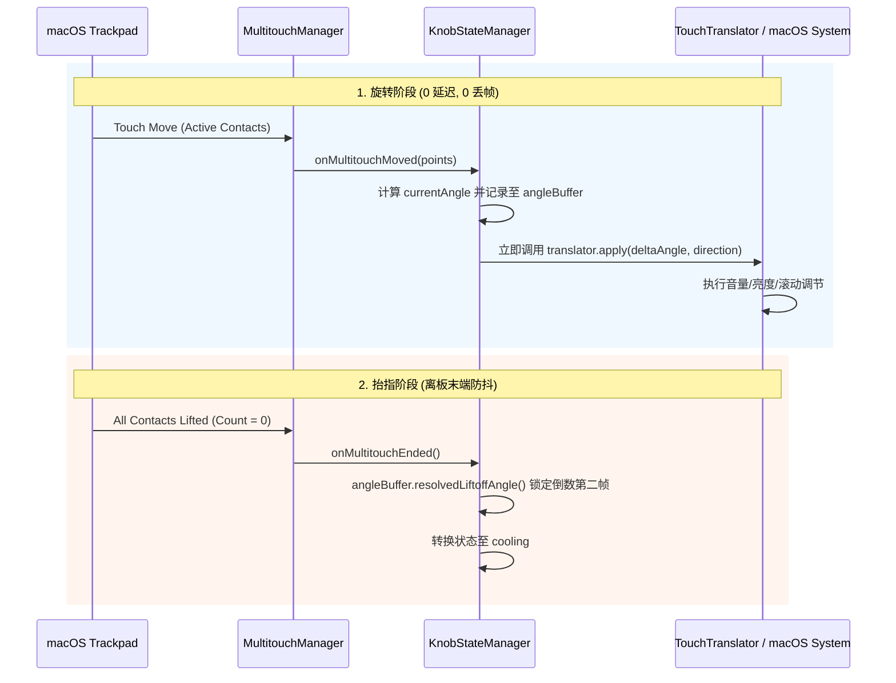

# 旋钮旋转顺滑度恢复与离板防抖设计文档 (Design Specification)

## 1. 背景与问题描述
在 8 月 1 日及后续版本中，为了防止手势离开触控板（Liftoff）时的尾端旋转抖动，引入了以下两项机制：
1. **MultitouchManager 强行丢包**：在触点状态包含 `state == 5` (Ending) 或 `state == 6` (Disconnected) 时，丢弃当帧 `onMultitouchMoved` 事件。
2. **KnobStateManager 100ms 保护锁**：当触点数量从 `>= 2` 变为 `< 2` 时，启动 100ms 保护锁定窗口，在此期间拦截并跳过 `translator.apply()`。

在实际旋转过程中，由于触控板采样、手指接触面积及压力的微小波动，macOS 触控板驱动经常在正常旋转中途产生瞬态的 `state 5/6` 状态或短暂的触点数波动（2指 ➔ 1指 ➔ 2指）。上述两项机制导致了旋转过程中频繁掉帧顿挫，并造成高达 100ms（6~12 帧）的硬性响应冻结，引发明显的旋转卡顿与不跟手感。

本设计旨在彻底恢复旋钮旋转时的 **0 延迟、0 丢帧** 顺滑体验，同时保留抬指完全离开触控板时的末端静止防抖能力。

---

## 2. 核心架构与修改点

### 2.1 [MultitouchManager.swift](file:///Users/wb/work/phantom_knob_mac/PhantomKnob/Service/MultitouchManager.swift)
- **取消 `isReleasing` 丢帧机制**：移除 `MultitouchManager.isAnyContactReleasing(states:)` 判定方法。
- **实时分发 Moved 事件**：只要处于手势中（`inGesture == true`）且活动触点数 `activePoints.count >= 1`，无条件将所有的触点位置变化通过 `DispatchQueue.main.async` 分发至 `delegate?.onMultitouchMoved(points:)`。

### 2.2 [KnobStateManager.swift](file:///Users/wb/work/phantom_knob_mac/PhantomKnob/Service/KnobStateManager.swift)
- **彻底移除 100ms 保护锁**：
  - 删除 `transitionToOneFingerTime` 和 `previousPointCount` 状态变量。
  - 移除 `onMultitouchMoved` 中计算 `elapsed < 0.100` 并判定 `isTransitionLocked` 的分支逻辑。
  - 移除 `if !isTransitionLocked` 的判定，确保每次计算出的 `deltaAngle` 无延迟调用 `translator.apply(units:deltaAngle, direction:direction)`。
- **保留抬指末端防抖（`KnobAngleBuffer`）**：
  - 旋转过程中，继续将实时角度记录至 `angleBuffer.append(angle: currentAngle)`。
  - 在手势完全结束（`onMultitouchEnded`）时，若处于 `knobing` 状态，调用 `angleBuffer.resolvedLiftoffAngle()` 获取稳定倒数第二帧角度并更新 `self.currentAngle`，防止抬指瞬间的甩尾尾跳。

### 2.3 单元测试更新
- 更新 [KnobLiftoffFilterTests.swift](file:///Users/wb/work/phantom_knob_mac/PhantomKnob/PhantomKnobTests/KnobLiftoffFilterTests.swift)：
  - 移除针对 100ms 锁机制的测试用例。
  - 验证连续 `onMultitouchMoved` 的无锁即时响应性能。
  - 验证 `onMultitouchEnded` 时抬指角度缓冲锁定的正确性。

---

## 3. 极简序列图

---

## 4. 规格自检 (Spec Self-Check)
1. **占位符检查**：无任何 TODO、待定或不确定表述。
2. **一致性检查**：`MultitouchManager` 与 `KnobStateManager` 保持一致，均移除了中途拦截机制，仅在 `Ended` 处保留尾端角度缓冲。
3. **范围检查**：专注解决旋钮旋转卡顿，不引入不必要的无关重构。
4. **歧义性检查**：定义明确，不存在两种理解可能。
